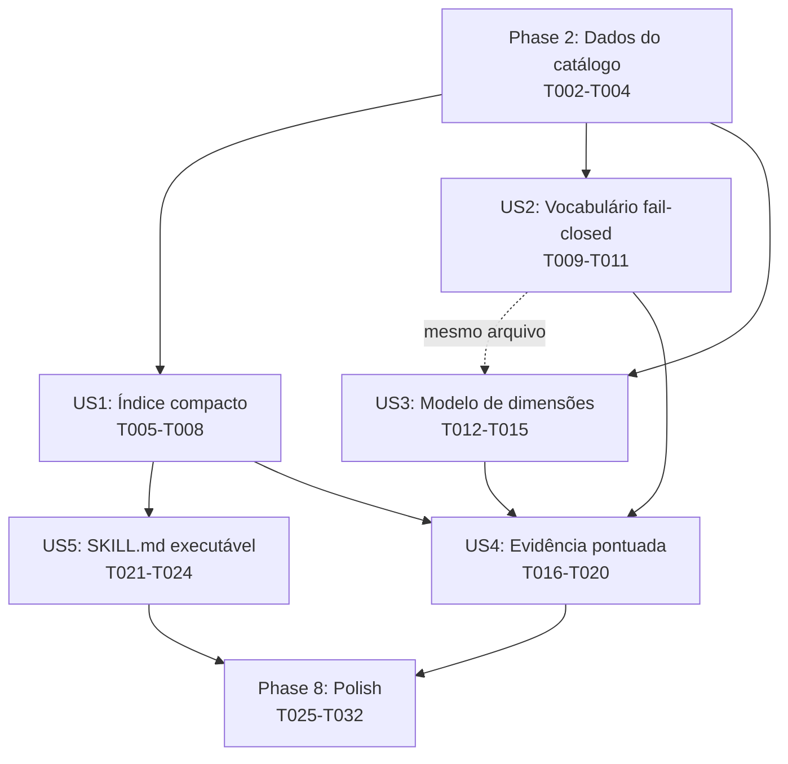

---

description: "Task list for feature implementation"
---

# Tasks: Acesso ao catálogo visual da skill Filament 5 UI/UX

**Input**: Design documents from `/specs/001-visual-catalog-access/`

**Prerequisites**: plan.md, spec.md, research.md, data-model.md, contracts/, quickstart.md, constitution.md

**Tests**: Esta feature **exige** cobertura automatizada (FR-020). As tarefas de teste estão incluídas e seguem o padrão existente de carregamento por `importlib.util.spec_from_file_location` no arquivo único `tests/test_laravel_filament_5_ui_ux.py`.

**Organization**: Tarefas agrupadas por user story. A feature vive inteiramente em `skills/laravel-filament-5-ui-ux/`, mais o arquivo de testes na raiz e o glossário `CONTEXT.md` (monorepo de skills, sem camada de aplicação).

## Format: `[ID] [P?] [Story] Description`

- **[P]**: Paralelizável (arquivos distintos, sem dependência de tarefa incompleta)
- **[Story]**: A qual user story a tarefa pertence (US1–US5)
- Caminhos de arquivo são exatos e relativos à raiz do repositório

## Path Conventions

- **Monorepo de skills**: código da feature em `skills/laravel-filament-5-ui-ux/`; suíte única em `tests/`; glossário em `CONTEXT.md` na raiz.
- Sem `src/`, sem `backend/`/`frontend/`. Os caminhos abaixo já refletem a estrutura real do `plan.md`.

---

## Phase 1: Setup (Linha de base)

**Purpose**: Confirmar o piso de testes antes de qualquer alteração.

- [x] T001 Confirmar a linha de base executando `python3 -m unittest discover -s tests` (31 testes passam) — referência: tests/test_laravel_filament_5_ui_ux.py

---

## Phase 2: Foundational (Preparo dos dados do catálogo)

**Purpose**: Todas as edições em `references/visual-catalog.json` feitas primeiro. É um único arquivo, é a raiz de dependência do gerador de índice, da consulta e do validador, e o `plan.md` ordena "dados primeiro".

**⚠️ CRITICAL**: Nenhuma user story pode começar antes desta fase. Sem `routed_reference` o índice não é projeção pura; sem os retags responsivos a seleção da História 3 está errada.

- [x] T002 Adicionar o campo `routed_reference` (string, caminho relativo para uma referência de composição existente sob `references/`) a todos os 22 patterns revisados em skills/laravel-filament-5-ui-ux/references/visual-catalog.json — mapear cada pattern à sua referência conforme a lógica de roteamento de data-model.md (form/schema roteiam para três referências distintas conforme composição de página, campo ordinário ou entrada complexa) — serve FR-001/US1
- [x] T003 Reescrever o campo `scope` na raiz de skills/laravel-filament-5-ui-ux/references/visual-catalog.json para descrever as nove superfícies cobertas (texto atual é anterior à fusão das skills) — serve FR-022
- [x] T004 Acrescentar `mobile-first` a `responsive_contexts[]` de `responsive-identity-centred-table` e `operational-dashboard` em skills/laravel-filament-5-ui-ux/references/visual-catalog.json (`record-detail-infolist` já declara ambos e não é alterado) — serve FR-010/US3

**Checkpoint**: Dados do catálogo completos; gerador, consulta e validador podem construir sobre eles.

---

## Phase 3: User Story 1 — Escolher um pattern sem carregar o catálogo inteiro (Priority: P1) 🎯 MVP

**Goal**: Um agente seleciona um pattern a partir de um índice compacto derivado, sem abrir o catálogo de 78 KB. Sozinha, esta história já entrega uma skill utilizável.

**Independent Test**: quickstart V1 (índice existe, determinístico, abaixo de 7.805 bytes, 22 linhas de pattern, 6 listas de vocabulário, `available_width` ausente) + V2 (deriva detectada).

### Implementation for User Story 1

- [x] T005 [P] [US1] Criar o gerador de índice skills/laravel-filament-5-ui-ux/scripts/build_catalog_index.py que projeta o catálogo em Markdown: tabela de patterns ordenada por identificador (Pattern, Surfaces, Goals, Responsive contexts, Reference, Evidence) seguida das 6 listas de vocabulário em ordem alfabética, excluindo `available_width`, `selection_weight` e campos de prosa — conforme contracts/catalog-index.md (depende T002)
- [x] T006 [US1] Gerar e versionar skills/laravel-filament-5-ui-ux/references/visual-catalog-index.md executando `python3 skills/laravel-filament-5-ui-ux/scripts/build_catalog_index.py --output skills/laravel-filament-5-ui-ux/references/visual-catalog-index.md` e confirmar determinismo (duas execuções idênticas) e tamanho abaixo de 7.805 bytes (depende T005)
- [x] T007 [P] [US1] Adicionar verificação de deriva a skills/laravel-filament-5-ui-ux/scripts/validate_visual_catalog.py: regenerar o índice em memória e comparar com o arquivo versionado (reprovar na diferença, com mensagem instruindo a regeneração), e verificar que todo pattern declara `routed_reference` apontando para um arquivo existente — o `main()` acumula erros das famílias de inventário e de índice (depende T005, T002)
- [x] T008 [US1] Adicionar grupo de testes de deriva do índice a tests/test_laravel_filament_5_ui_ux.py: o índice versionado bate byte a byte com a regeneração; uma divergência introduzida deliberadamente é detectada — FR-003, FR-020 (depende T006, T007)

**Checkpoint**: V1 e V2 passam. A via primária de seleção existe e é verificada.

---

## Phase 4: User Story 2 — Vocabulário inválido falha de forma visível (Priority: P1)

**Goal**: Um termo fora do vocabulário controlado, em qualquer dimensão, é recusado sem produzir seleção, nomeando a dimensão e sugerindo os termos válidos mais próximos.

**Independent Test**: quickstart V3 (`organise-stable-groups` → erro sugerindo `organize-stable-groups`; `fromm` → erro na dimensão surface; `--list-vocabulary` mostra 6 listas; `--help` mostra choices).

### Implementation for User Story 2

- [x] T009 [US2] Adicionar validação de vocabulário a `query_catalog()` em skills/laravel-filament-5-ui-ux/scripts/query_visual_catalog.py: cada dimensão valida seu termo contra o vocabulário extraído do catálogo e, ao falhar, levanta erro nomeando a dimensão com sugestões de `difflib.get_close_matches` (sem sugestão próxima, lista os termos válidos da dimensão) — a validação vive na função, não só no argparse — FR-006, decisão D3
- [x] T010 [US2] Adicionar `--list-vocabulary` e `choices` derivados do catálogo para toda dimensão na CLI de skills/laravel-filament-5-ui-ux/scripts/query_visual_catalog.py, tornando `--help` autodescritivo — FR-007 (mesmo arquivo que T009)
- [x] T011 [US2] Adicionar grupo de testes de rejeição de vocabulário a tests/test_laravel_filament_5_ui_ux.py: termo inválido em cada dimensão levanta com sugestão e não produz seleção; `--list-vocabulary` coincide com o catálogo — FR-006, FR-020 (depende T009, T010)

**Checkpoint**: V3 passa. Nenhum termo inválido produz seleção.

> **Nota de arquivo compartilhado**: T009–T011 e os T012–T014 da US3 editam o mesmo `query_visual_catalog.py`. Sequenciar US2 antes de US3 (ou coordenar a edição) para evitar conflito.

---

## Phase 5: User Story 3 — Uma pergunta sobre celular seleciona o pattern responsivo (Priority: P1)

**Goal**: A superfície é a única dimensão restritiva; todas as demais ordenam por peso; uma consulta `mobile-first` de tabela seleciona `responsive-identity-centred-table`; nenhuma consulta com vocabulário válido retorna conjunto vazio.

**Independent Test**: quickstart V4 (tabela `mobile-first` → `responsive-identity-centred-table`) + V5 (zero combinações vazias na matriz completa).

### Implementation for User Story 3

- [x] T012 [US3] Reescrever a pontuação em `query_catalog()` de skills/laravel-filament-5-ui-ux/scripts/query_visual_catalog.py: a superfície é o único filtro restritivo; objetivo, fluxo de trabalho, contexto responsivo, forma de informação e relacionamento somam peso positivo ao casar (zero ao não casar); remover a penalidade `-100` e o corte por pontuação não negativa; ordenar por peso decrescente, desempatando por identificador — FR-008, FR-009, FR-011, FR-012, decisão D4 (depende T009 — mesmo arquivo)
- [x] T013 [US3] Remover o parâmetro `available_width` de `query_catalog()` e a opção `--available-width` da CLI em skills/laravel-filament-5-ui-ux/scripts/query_visual_catalog.py (o campo permanece como metadado descritivo no catálogo) — FR-008, decisão D5 (mesmo arquivo)
- [x] T014 [US3] Remover o caminho de erro e a mensagem `"No reviewed visual pattern matches the requested surface. Use official Filament 5 evidence and record the catalog gap."` em skills/laravel-filament-5-ui-ux/scripts/query_visual_catalog.py (deixa de ser alcançável para superfície válida) — decisão D4 (mesmo arquivo)
- [x] T015 [US3] Atualizar as 15 referências a `available_width` em tests/test_laravel_filament_5_ui_ux.py para a nova assinatura e adicionar o grupo de testes de seleção responsiva (tabela `mobile-first` → `responsive-identity-centred-table`; invariante de conjunto não vazio para toda consulta com vocabulário válido) — FR-008, FR-011, FR-020 (depende T012, T013)

**Checkpoint**: V4 e V5 passam. O caso do eval #10 está corrigido.

---

## Phase 6: User Story 4 — A release traz evidência pontuada (Priority: P2)

**Goal**: Cada uma das 15 asserções dos cenários carrega veredito (`pass`/`fail`) com citação do transcript; `review_required` é derivado. Depende das Histórias 1–3, pois pontua o comportamento novo.

**Independent Test**: quickstart V7 (15 resultados; toda asserção com veredito e citação; `codex.json`/`cursor.json` removidos; reprovação registrada é válida).

### Implementation for User Story 4

- [x] T016 [US4] Reescrever os registros de asserção em skills/laravel-filament-5-ui-ux/scripts/run_forward_evals.py: asserções passam a ser objetos `{assertion, verdict: "unscored", evidence: ""}`; `review_required` passa a ser derivado (verdadeiro enquanto houver qualquer `unscored`); tornar `--output` obrigatória — FR-017, FR-018, decisão D6
- [x] T017 [P] [US4] Remover skills/laravel-filament-5-ui-ux/evals/forward-runs/codex.json e skills/laravel-filament-5-ui-ux/evals/forward-runs/cursor.json — nunca pontuados, nunca constituíram evidência — FR-019
- [x] T018 [US4] Re-executar os 15 cenários contra a skill resultante com `python3 skills/laravel-filament-5-ui-ux/scripts/run_forward_evals.py --agent claude-code --output skills/laravel-filament-5-ui-ux/evals/forward-runs/claude-code.json` (requer o agente disponível; substitui o `claude-code.json` atual) — FR-017 (depende T016, US1–US3)
- [x] T019 [US4] Pontuar cada asserção em skills/laravel-filament-5-ui-ux/evals/forward-runs/claude-code.json lendo o transcript de cada cenário e preenchendo `verdict` (`pass`/`fail`) e `evidence` (citação); um `fail` registrado é resultado legítimo — FR-017, FR-018, decisão D6 (depende T018; ato de revisão, não automatizável por casamento de texto)
- [x] T020 [P] [US4] Reescrever skills/laravel-filament-5-ui-ux/references/release-verification.md do modelo de evidência multiagente para agente único — FR-019

**Checkpoint**: V7 passa. Toda asserção pontuada com citação.

---

## Phase 7: User Story 5 — O SKILL.md descreve o fluxo que realmente acontece (Priority: P2)

**Goal**: Todo passo do SKILL.md é executável a partir de um projeto arbitrário; sem instruções de manutenção; tabela de roteamento única. Depende da US1 (o índice precisa existir).

**Independent Test**: quickstart V6 (índice como via primária, ferramenta como alternativa condicionada, sem caminhos relativos, sem sync/review/validation, tabela de roteamento única, autoridade+delegação preservadas).

### Implementation for User Story 5

- [x] T021 [US5] Reescrever o passo de consulta em skills/laravel-filament-5-ui-ux/SKILL.md: apresentar a leitura de references/visual-catalog-index.md como via primária (caminho resolvido a partir do diretório instalado da skill, não relativo ao diretório de trabalho) e a consulta por ferramenta como alternativa condicionada à disponibilidade de execução — FR-013, decisão D7 (depende T006)
- [x] T022 [US5] Remover de skills/laravel-filament-5-ui-ux/SKILL.md as instruções de manutenção do catálogo (sincronização, geração de folhas de revisão, validação) — elas migram para o README.md (T025) — FR-014
- [x] T023 [US5] Reduzir o roteamento pattern→referência a uma única tabela em skills/laravel-filament-5-ui-ux/SKILL.md, removendo o parágrafo duplicado — FR-015
- [x] T024 [US5] Verificar que a seção de autoridade e escapes e a delegação a `laravel-filament-v5` permanecem em skills/laravel-filament-5-ui-ux/SKILL.md com conteúdo e força idênticos — FR-016

**Checkpoint**: V6 passa. O fluxo é executável ponta a ponta.

---

## Phase 8: Polish & Cross-Cutting Concerns

**Purpose**: Sincronização de documentação humana, versionamento e validação final que cruzam todas as histórias.

- [x] T025 Sincronizar a seção Structure de skills/laravel-filament-5-ui-ux/README.md para listar todos os arquivos existentes da skill (incluindo os 5 hoje omitidos) e receber as instruções de manutenção do catálogo removidas do SKILL.md — FR-014, FR-022 (depende T022)
- [x] T026 [P] Adicionar o termo "índice compacto" / "compact index" ao glossário CONTEXT.md — convenção de repositório (plan.md)
- [x] T027 Escrever skills/laravel-filament-5-ui-ux/RELEASE.md para 1.1.0 descrevendo a via primária nova de seleção e o veredito pontuado dos cenários — FR-021 (depende T019, T021)
- [x] T028 Elevar a versão da skill para 1.1.0 no frontmatter de skills/laravel-filament-5-ui-ux/SKILL.md — FR-021 (depende T021–T024)
- [x] T029 Executar `node skills/laravel-filament-5-ui-ux/scripts/validate_skill.mjs` (validador de pacote) e corrigir o que reportar — SC-005
- [x] T030 Executar `python3 skills/laravel-filament-5-ui-ux/scripts/release_install_smoke.py` — quickstart V6
- [x] T031 Executar a suíte completa `python3 -m unittest discover -s tests` e confirmar que cresceu além dos 31 testes com os três grupos de FR-020 (vocabulário, deriva do índice, seleção responsiva) e que nenhuma referência a `available_width` permanece nos testes — FR-020, quickstart V8
- [x] T032 Executar a validação completa do quickstart na ordem V1→V2→V3→V4→V5→V6→V8→V7 (V7 por último, pois pontua o comportamento final) e confirmar cada resultado Esperado — quickstart

---

## Dependencies & Execution Order

### Grafo de dependências



### Phase Dependencies

- **Setup (Phase 1)**: Sem dependências — começa imediatamente.
- **Foundational (Phase 2)**: Após Setup. **BLOQUEIA todas as user stories** (é a raiz de dados).
- **User Stories (Phase 3–7)**: Todas dependem da Phase 2.
  - US1, US2 podem prosseguir em paralelo após a Phase 2.
  - US3 depende de US2 **por arquivo compartilhado** (`query_visual_catalog.py`), não por lógica — sequenciar ou coordenar.
  - US5 depende de US1 (o arquivo de índice precisa existir — T006).
  - US4 depende de US1+US2+US3 (pontua o comportamento resultante).
- **Polish (Phase 8)**: Depende de US4 e US5.

### Within Each User Story

- Testes escritos para falhar antes da implementação (onde aplicável).
- Scripts/geradores antes dos artefatos que produzem.
- Dados antes da lógica que os consome.
- Story completa antes de seguir para a próxima prioridade.

### Parallel Opportunities

- T002, T003, T004: **não paralelos** — mesmo arquivo (`visual-catalog.json`).
- T005 (gerador, arquivo novo) é paralelizável com o trabalho de US2/US3 se houver capacity.
- T006 e T007 são paralelizáveis entre si (arquivos distintos, ambos dependem só de T005).
- T017 (remover arquivos) e T020 (release-verification.md) e T026 (CONTEXT.md) são independentes entre si.
- US1, US2 são paralelizáveis após a Phase 2 (arquivos distintos: `build_catalog_index.py`/`validate_visual_catalog.py` vs `query_visual_catalog.py`).
- US2 e US3 **não** são paralelizáveis entre si (mesmo `query_visual_catalog.py`).

---

## Parallel Example: User Story 1

```bash
# Após T005 (gerador pronto), lançar em paralelo:
Task: "T006 Gerar e versionar references/visual-catalog-index.md"
Task: "T007 Adicionar verificação de deriva a validate_visual_catalog.py"

# Depois, em sequência:
Task: "T008 Grupo de testes de deriva em tests/test_laravel_filament_5_ui_ux.py"
```

---

## Implementation Strategy

### MVP First (User Story 1 apenas)

1. Completar Phase 1: Setup (confirmar linha de base).
2. Completar Phase 2: Foundational (dados do catálogo) — **CRÍTICO, bloqueia tudo**.
3. Completar Phase 3: User Story 1 (índice compacto + deriva).
4. **PARAR E VALIDAR**: V1 + V2 passam; a via primária de seleção funciona por leitura do índice.
5. A skill já é utilizável: um agente lê o índice e seleciona o pattern correto sem o catálogo de 78 KB.

### Incremental Delivery

1. Setup + Foundational → dados prontos.
2. + US1 → via primária de seleção (MVP).
3. + US2 → vocabulário inválido falha fechado.
4. + US3 → modelo de dimensões corrigido (eval #10 resolvido).
5. + US4 → evidência pontuada por asserção.
6. + US5 → SKILL.md executável ponta a ponta.
7. Polish → documentação sincronizada, versão 1.1.0, validação completa V1–V8.

### Parallel Team Strategy

Com múltiplos desenvolvedores após a Phase 2:

- Dev A: US1 (índice) → US5 (SKILL.md).
- Dev B: US2 (vocabulário) → US3 (dimensões) [sequencial, mesmo arquivo].
- Dev C: US4 (evidência) — espera US1–US3.
- Polish ao final, em conjunto.

---

## Notes

- **[P]** = arquivos distintos, sem dependência de tarefa incompleta.
- **[Story]** mapeia a tarefa à user story para rastreabilidade.
- Os retags responsivos (T004) e o campo `scope` (T003) estão na Phase 2 por serem edição do mesmo arquivo de dados e por o `plan.md` ordenar "dados primeiro"; servem a US3 e FR-022 respectivamente, rastreáveis pelas referências de FR.
- T018 (re-execução dos cenários) requer o agente `claude-code` disponível; T019 (pontuação) é ato de revisão humana sobre transcript — não automatizável por casamento de texto (decisão D6).
- Reprovação registrada (p.ex. cenário #10 no eixo de evidência de imagem) é resultado legítimo e válido; nenhum critério exige 15 de 15 aprovações.
- O conteúdo de composição visual (9 referências + campos de julgamento dos 22 patterns) **não é tocado** por esta feature.
- Commitar após cada tarefa ou grupo lógico; parar em qualquer checkpoint para validar a story independentemente.

## Phase 9: Convergence

- [x] T033 ~~Re-executar os 15 cenários contra a skill 1.1.0~~ — **cancelada**: custo de tokens da reexecução recusado; a evidência de release 1.1.0 permanece o registro migrado e pontuado de `evals/forward-runs/claude-code.json` (transcripts de 2026-08-04, schema v2, `review_required: false`). Gap FR-017/US4/AC1 aceito conscientemente — per FR-017, US4/AC1 (partial, waived)
