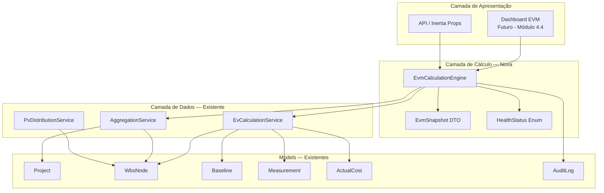
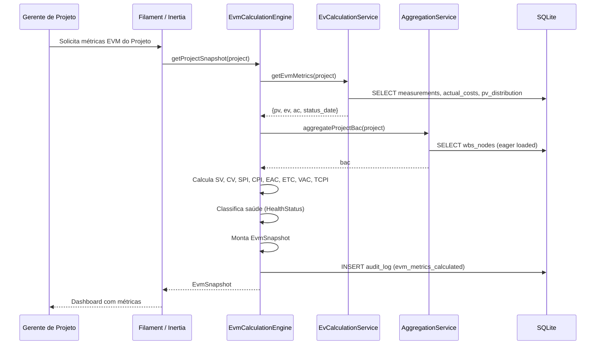
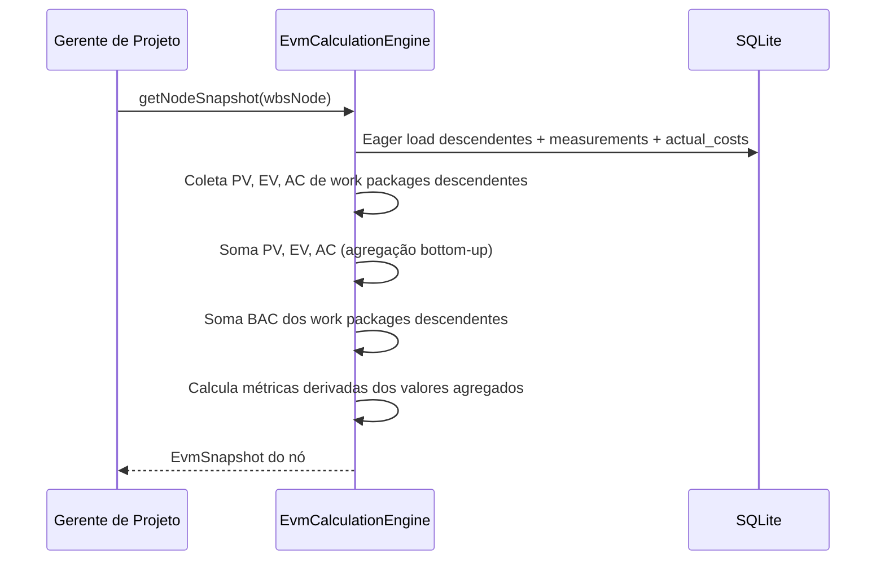
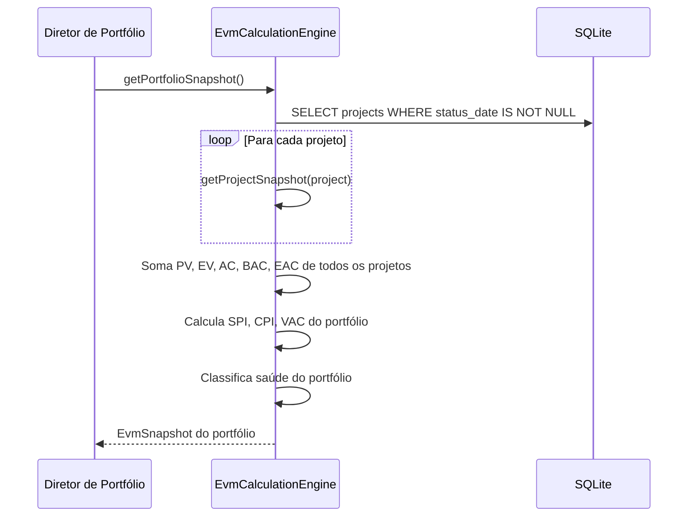

# Design — Motor de Cálculo EVM (Monitoramento)

## Overview

Este documento descreve o design técnico do Motor de Cálculo EVM, o núcleo analítico da plataforma de gestão de projetos baseada em Earned Value Management. O módulo calcula automaticamente todas as métricas derivadas de EVM — variações (SV, CV), índices de desempenho (SPI, CPI), projeções (EAC, ETC, VAC) e índice de desempenho necessário (TCPI) — a partir das métricas base (PV, EV, AC) já fornecidas pelos módulos anteriores.

O módulo **estende** a arquitetura existente, reutilizando integralmente os models e services dos dois módulos predecessores:

- **Módulo de Estruturação e Baseline** (`project-structuring-baseline`): `Project`, `WbsNode`, `Baseline`, `AuditLog`, `User`, `AggregationService`, `PvDistributionService`, `BaselineService`.
- **Módulo de Apontamento e Medição** (`measurement-tracking`): `Measurement`, `ActualCost`, `WeightedMilestone`, `EvCalculationService`.

**Não são criadas novas tabelas no banco de dados.** Este módulo é puramente uma camada de cálculo e serviço que opera sobre os dados existentes.

### Decisões de Design

1. **Novo service `EvmCalculationEngine` em vez de estender `EvCalculationService`**: O `EvCalculationService` existente é responsável por calcular EV, registrar medições e custos reais, e agregar PV/EV/AC no nível do projeto. O novo `EvmCalculationEngine` consome a saída do `EvCalculationService` (via `getEvmMetrics()`) e calcula todas as métricas derivadas. Essa separação respeita o princípio de responsabilidade única — o service existente lida com dados brutos, o novo lida com análise.

2. **DTO `EvmSnapshot` como Value Object**: Todas as métricas EVM são encapsuladas em um DTO imutável (`EvmSnapshot`) com métodos `toArray()` e `fromArray()`. Isso garante tipagem forte, serialização consistente e facilita a transmissão para o frontend via Inertia.

3. **Enum `HealthStatus` para classificação semafórica**: A classificação de saúde (Verde, Amarelo, Vermelho, Cinza) é implementada como enum PHP com `HasLabel`, `HasColor` e `HasIcon`, seguindo o padrão do projeto. Os limiares são constantes no enum, configuráveis via refatoração futura.

4. **Agregação bottom-up por nó da EAP**: Para calcular métricas em qualquer nível da EAP (não apenas no projeto), o `EvmCalculationEngine` implementa agregação recursiva que coleta PV, EV e AC de todos os work packages descendentes de um nó, e então calcula as métricas derivadas a partir dos valores agregados. Índices (SPI, CPI) são calculados a partir dos valores agregados, **nunca** como média dos índices dos filhos.

5. **Portfólio como agregação de projetos**: As métricas de portfólio são calculadas somando PV, EV, AC, BAC e EAC de todos os projetos com `status_date` definida. Cada projeto é processado independentemente para evitar carregar todos os work packages simultaneamente.

6. **Eager loading com batch queries**: Para projetos com 1000+ work packages, o engine carrega a árvore EAP completa com `load()` e busca medições e custos reais em batch queries (uma query por tipo), evitando o problema N+1.

7. **Divisão por zero retorna `null`**: Quando o divisor é zero (PV=0 para SPI, AC=0 para CPI, BAC-AC=0 para TCPI), o resultado é `null` (indeterminado), não uma exceção. A classificação semafórica trata `null` como Cinza.

8. **Caso especial: 100% concluído**: Quando EV = BAC, o EAC é simplesmente AC (custo real final), ETC é zero, e VAC é BAC - AC. Isso evita divisão por CPI quando o trabalho já está completo.

## Architecture

### Diagrama de Componentes (Extensão)



### Fluxo de Dados Principal



### Fluxo de Agregação por Nó da EAP



### Fluxo de Consolidação de Portfólio



## Components and Interfaces

### Services — Novos

| Service                | Responsabilidade                                                                                                                                                                                          |
| ---------------------- | --------------------------------------------------------------------------------------------------------------------------------------------------------------------------------------------------------- |
| `EvmCalculationEngine` | Calcula todas as métricas derivadas de EVM (SV, CV, SPI, CPI, EAC, ETC, VAC, TCPI). Agrega métricas em qualquer nível da EAP. Consolida métricas no nível de portfólio. Registra auditoria de recálculos. |

### DTOs — Novos

| DTO           | Responsabilidade                                                                                                                                                                                     |
| ------------- | ---------------------------------------------------------------------------------------------------------------------------------------------------------------------------------------------------- |
| `EvmSnapshot` | Value Object imutável contendo todas as métricas EVM: PV, EV, AC, BAC, SV, CV, SPI, CPI, EAC, ETC, VAC, TCPI, classificação semafórica (schedule_health, cost_health, overall_health) e status_date. |

### Enums — Novos

| Enum           | Valores                          | Labels pt-BR                                  |
| -------------- | -------------------------------- | --------------------------------------------- |
| `HealthStatus` | `green`, `yellow`, `red`, `gray` | "Saudável", "Atenção", "Crítico", "Sem Dados" |

### Interface do `EvmCalculationEngine`

```php
class EvmCalculationEngine
{
    public function __construct(
        private EvCalculationService $evCalculationService,
        private AggregationService $aggregationService,
        private PvDistributionService $pvDistributionService,
    ) {}

    /**
     * Calcula o snapshot EVM completo para um projeto inteiro.
     */
    public function getProjectSnapshot(Project $project): EvmSnapshot;

    /**
     * Calcula o snapshot EVM para um nó específico da EAP.
     * Para work packages: métricas diretas.
     * Para nós não-folha: métricas agregadas dos descendentes.
     */
    public function getNodeSnapshot(WbsNode $node): EvmSnapshot;

    /**
     * Calcula o snapshot EVM consolidado do portfólio.
     * Soma PV, EV, AC, BAC e EAC de todos os projetos com status_date definida.
     */
    public function getPortfolioSnapshot(): EvmSnapshot;

    /**
     * Calcula as métricas derivadas a partir de valores base.
     * Método puro, sem side effects — usado internamente e testável isoladamente.
     */
    public function calculateDerivedMetrics(
        float $pv,
        float $ev,
        float $ac,
        float $bac,
    ): array;

    /**
     * Classifica a saúde com base em um índice (SPI ou CPI).
     */
    public function classifyHealth(?float $index): HealthStatus;
}
```

### Interface do `EvmSnapshot` DTO

```php
final readonly class EvmSnapshot
{
    public function __construct(
        public float $pv,
        public float $ev,
        public float $ac,
        public float $bac,
        public float $sv,
        public float $cv,
        public ?float $spi,
        public ?float $cpi,
        public float $eac,
        public float $etc,
        public float $vac,
        public ?float $tcpi,
        public HealthStatus $scheduleHealth,
        public HealthStatus $costHealth,
        public HealthStatus $overallHealth,
        public ?string $statusDate,
    ) {}

    /**
     * Serializa para array JSON-compatível.
     * Valores nulos são preservados como null.
     *
     * @return array<string, mixed>
     */
    public function toArray(): array;

    /**
     * Reconstrói o EvmSnapshot a partir de um array serializado.
     *
     * @param array<string, mixed> $data
     */
    public static function fromArray(array $data): self;
}
```

### Interface do `HealthStatus` Enum

```php
enum HealthStatus: string implements HasLabel, HasColor, HasIcon
{
    case Green = 'green';
    case Yellow = 'yellow';
    case Red = 'red';
    case Gray = 'gray';

    // Limiares padrão
    public const float GREEN_THRESHOLD = 1.0;
    public const float YELLOW_THRESHOLD = 0.9;

    public function getLabel(): string;   // "Saudável", "Atenção", "Crítico", "Sem Dados"
    public function getColor(): string;   // "success", "warning", "danger", "gray"
    public function getIcon(): string;    // Heroicons apropriados

    /**
     * Classifica um índice (SPI ou CPI) em HealthStatus.
     */
    public static function fromIndex(?float $index): self;

    /**
     * Retorna o pior status entre dois (para saúde geral).
     */
    public static function worst(self $a, self $b): self;
}
```

### Services — Existentes (Reutilizados)

| Service                 | Uso neste módulo                                                                                              |
| ----------------------- | ------------------------------------------------------------------------------------------------------------- |
| `EvCalculationService`  | `getEvmMetrics()` fornece PV, EV, AC agregados do projeto. Métodos de carry-forward e agregação de EV por nó. |
| `AggregationService`    | `aggregateProjectBac()` e `aggregateBac()` fornecem BAC agregado em qualquer nível da EAP.                    |
| `PvDistributionService` | Fornece a distribuição de PV por período para cálculo de PV cumulativo por nó.                                |

## Data Models

### Nenhuma Nova Tabela

Este módulo **não cria novas tabelas** no banco de dados. Todas as métricas derivadas são calculadas em tempo real a partir dos dados existentes nas tabelas `projects`, `wbs_nodes`, `baselines`, `measurements` e `actual_costs`.

### EvmSnapshot DTO (Value Object)

O `EvmSnapshot` é um DTO (Data Transfer Object) imutável que encapsula todas as métricas EVM calculadas. Não é persistido no banco — é construído sob demanda e serializado para JSON quando transmitido ao frontend.

```
EvmSnapshot
├── pv: float              — Planned Value (valor planejado acumulado)
├── ev: float              — Earned Value (valor agregado)
├── ac: float              — Actual Cost (custo real)
├── bac: float             — Budget at Completion (orçamento total)
├── sv: float              — Schedule Variance (EV - PV)
├── cv: float              — Cost Variance (EV - AC)
├── spi: ?float            — Schedule Performance Index (EV / PV, null se PV=0)
├── cpi: ?float            — Cost Performance Index (EV / AC, null se AC=0)
├── eac: float             — Estimate at Completion
├── etc: float             — Estimate to Complete (EAC - AC)
├── vac: float             — Variance at Completion (BAC - EAC)
├── tcpi: ?float           — To-Complete Performance Index, null se indeterminado
├── scheduleHealth: HealthStatus  — Classificação semafórica de cronograma
├── costHealth: HealthStatus      — Classificação semafórica de custo
├── overallHealth: HealthStatus   — Pior entre schedule e cost
└── statusDate: ?string           — Data de status (Y-m-d)
```

### Formato JSON Serializado

```json
{
    "pv": 50000.0,
    "ev": 45000.0,
    "ac": 48000.0,
    "bac": 100000.0,
    "sv": -5000.0,
    "cv": -3000.0,
    "spi": 0.9,
    "cpi": 0.9375,
    "eac": 105333.33,
    "etc_value": 57333.33,
    "vac": -5333.33,
    "tcpi": 1.0577,
    "schedule_health": "yellow",
    "cost_health": "yellow",
    "overall_health": "yellow",
    "status_date": "2025-06-15"
}
```

**Nota:** O campo `etc` é serializado como `etc_value` no JSON para evitar conflito com a palavra reservada `etc` em alguns contextos.

### Fórmulas de Cálculo

| Métrica | Fórmula                   | Caso Especial                            |
| ------- | ------------------------- | ---------------------------------------- |
| SV      | `EV - PV`                 | Se PV=0 e EV=0, SV=0                     |
| CV      | `EV - AC`                 | Se EV=0 e AC=0, CV=0                     |
| SPI     | `EV / PV`                 | Se PV=0, SPI=null                        |
| CPI     | `EV / AC`                 | Se AC=0, CPI=null                        |
| EAC     | `AC + (BAC - EV) / CPI`   | Se CPI=null: `BAC - EV`. Se EV=BAC: `AC` |
| ETC     | `EAC - AC`                | Se EV=BAC: 0                             |
| VAC     | `BAC - EAC`               | Se CPI=null: 0. Se EV=BAC: `BAC - AC`    |
| TCPI    | `(BAC - EV) / (BAC - AC)` | Se BAC=AC: null. Se EV=BAC: null         |

### Regras de Agregação

| Nível        | PV, EV, AC, SV, CV        | SPI, CPI                                         | EAC, ETC                           | TCPI                                        | BAC                                |
| ------------ | ------------------------- | ------------------------------------------------ | ---------------------------------- | ------------------------------------------- | ---------------------------------- |
| Work Package | Valores diretos           | EV/PV, EV/AC                                     | Fórmula direta                     | Fórmula direta                              | Da Baseline                        |
| Nó não-folha | Soma dos filhos recursiva | EV_agregado/PV_agregado, EV_agregado/AC_agregado | Soma dos EACs dos WPs descendentes | (BAC_nó - EV_nó) / (BAC_nó - AC_nó)         | Soma dos BACs dos WPs descendentes |
| Projeto      | Soma de todos os WPs      | EV_projeto/PV_projeto, EV_projeto/AC_projeto     | Soma dos EACs de todos os WPs      | (BAC_proj - EV_proj) / (BAC_proj - AC_proj) | Soma dos BACs de todos os WPs      |
| Portfólio    | Soma de todos os projetos | EV_port/PV_port, EV_port/AC_port                 | Soma dos EACs dos projetos         | N/A (não calculado)                         | Soma dos BACs dos projetos         |

### Diagrama de Dependência de Dados

```mermaid
graph LR
    subgraph "Dados Base (Existentes)"
        PV[PV — PvDistributionService]
        EV[EV — EvCalculationService]
        AC[AC — ActualCost records]
        BAC[BAC — Baseline snapshot]
    end

    subgraph "Métricas Derivadas (Novas)"
        SV[SV = EV - PV]
        CV[CV = EV - AC]
        SPI[SPI = EV / PV]
        CPI[CPI = EV / AC]
        EAC[EAC = AC + &#40;BAC - EV&#41; / CPI]
        ETC[ETC = EAC - AC]
        VAC[VAC = BAC - EAC]
        TCPI[TCPI = &#40;BAC - EV&#41; / &#40;BAC - AC&#41;]
    end

    subgraph "Classificação"
        SH[Schedule Health]
        CH[Cost Health]
        OH[Overall Health]
    end

    PV --> SV
    EV --> SV
    EV --> CV
    AC --> CV
    EV --> SPI
    PV --> SPI
    EV --> CPI
    AC --> CPI
    CPI --> EAC
    BAC --> EAC
    EV --> EAC
    AC --> EAC
    EAC --> ETC
    AC --> ETC
    BAC --> VAC
    EAC --> VAC
    BAC --> TCPI
    EV --> TCPI
    AC --> TCPI
    SPI --> SH
    CPI --> CH
    SH --> OH
    CH --> OH
```



## Correctness Properties

_A property is a characteristic or behavior that should hold true across all valid executions of a system — essentially, a formal statement about what the system should do. Properties serve as the bridge between human-readable specifications and machine-verifiable correctness guarantees._

### Property 1: Derived metrics formula correctness

_For any_ set of base metrics (PV, EV, AC, BAC) where PV ≥ 0, EV ≥ 0, AC ≥ 0, BAC ≥ 0, the `calculateDerivedMetrics` method SHALL produce:

- SV = EV - PV
- CV = EV - AC
- SPI = EV / PV when PV > 0, null when PV = 0
- CPI = EV / AC when AC > 0, null when AC = 0
- EAC = AC when EV = BAC (100% complete); BAC - EV when AC = 0 (CPI null); AC + (BAC - EV) / CPI otherwise
- ETC = EAC - AC
- VAC = BAC - EAC
- TCPI = (BAC - EV) / (BAC - AC) when BAC ≠ AC and EV ≠ BAC, null otherwise

**Validates: Requirements 1.1, 1.2, 1.6, 1.7, 2.1, 2.2, 2.3, 2.4, 2.5, 2.6, 3.1, 3.2, 3.3, 3.4, 3.5, 4.1, 4.2, 4.3, 4.4**

### Property 2: Decimal precision of computed metrics

_For any_ set of base metrics (PV, EV, AC, BAC), the computed SV, CV, EAC, ETC, and VAC SHALL have at most 2 decimal places, and the computed SPI, CPI, and TCPI (when not null) SHALL have at most 4 decimal places.

**Validates: Requirements 1.3, 2.7, 3.6, 4.5**

### Property 3: Bottom-up aggregation invariant

_For any_ valid WBS tree with PV, EV, and AC values assigned to leaf work packages, the PV, EV, and AC of any non-leaf node SHALL equal the sum of the respective values of all its descendant leaf work packages. Consequently, SV and CV at any non-leaf node SHALL also equal the sum of the respective values of its descendant leaves.

**Validates: Requirements 1.4, 1.5, 5.1, 5.2, 5.6, 5.7, 5.8**

### Property 4: Aggregated indices use summed values, not averaged children indices

_For any_ WBS tree where at least two leaf work packages have different SPI (or CPI) values, the SPI of a non-leaf ancestor SHALL equal EV_aggregated / PV_aggregated (and CPI = EV_aggregated / AC_aggregated), which SHALL differ from the arithmetic mean of the children's individual SPIs (or CPIs).

**Validates: Requirements 2.8, 5.3**

### Property 5: EAC aggregation equals sum of leaf EACs

_For any_ valid WBS tree, the EAC of any non-leaf node SHALL equal the sum of the EACs of all its descendant leaf work packages. Consequently, ETC at any non-leaf node SHALL also equal the sum of the ETCs of its descendant leaves, and VAC SHALL equal BAC_node - EAC_node.

**Validates: Requirements 3.7, 3.8, 3.9, 5.4**

### Property 6: Aggregation confluence

_For any_ set of work packages with assigned PV, EV, AC, and BAC values, the aggregated metrics at the project level SHALL be identical regardless of the order in which the work packages are processed.

**Validates: Requirements 5.5**

### Property 7: Portfolio aggregation includes only projects with status date

_For any_ set of projects where some have `status_date` defined and some do not, the portfolio PV, EV, AC, and EAC SHALL equal the sum of the respective values only from projects with `status_date` defined. The portfolio BAC SHALL equal the sum of BACs from projects with an active baseline. Projects without `status_date` SHALL not contribute to portfolio PV, EV, AC, or EAC.

**Validates: Requirements 6.1, 6.2, 6.3, 6.4, 6.5, 6.6, 6.7, 6.8, 6.9**

### Property 8: Health classification follows threshold rules

_For any_ numeric index value (SPI or CPI), the health classification SHALL be Green when index ≥ 1.0, Yellow when 0.9 ≤ index < 1.0, and Red when index < 0.9. _For any_ null index value, the classification SHALL be Gray.

**Validates: Requirements 7.1, 7.2, 7.3, 7.4**

### Property 9: Overall health equals worst of schedule and cost health

_For any_ pair of schedule health and cost health classifications, the overall health SHALL equal the worst of the two, where the severity ordering is Green < Yellow < Red, and Gray is treated as worse than Yellow but equal to Red for the purpose of the "worst" comparison.

**Validates: Requirements 7.5**

### Property 10: EvmSnapshot serialization round-trip

_For any_ valid EvmSnapshot (including snapshots with null SPI, CPI, and/or TCPI), serializing via `toArray()` and then deserializing via `fromArray()` SHALL produce an EvmSnapshot equivalent to the original, with all numeric values preserved within floating-point tolerance and all null values preserved as null.

**Validates: Requirements 10.1, 10.2, 10.3, 10.4**

### Property 11: Mathematical consistency between related metrics

_For any_ work package where SPI is defined (PV > 0), SV SHALL equal SPI × PV - PV (within floating-point tolerance). Similarly, _for any_ work package where CPI is defined (AC > 0), CV SHALL equal CPI × AC - AC (within floating-point tolerance). This metamorphic relationship validates internal consistency of the calculation engine.

**Validates: Requirements 13.1, 13.2, 13.7**

## Error Handling

### Divisão por Zero

| Cenário                                   | Comportamento                                                                                                                                                                                                                      |
| ----------------------------------------- | ---------------------------------------------------------------------------------------------------------------------------------------------------------------------------------------------------------------------------------- |
| PV = 0 ao calcular SPI                    | Retorna SPI = `null` (indeterminado). Classificação semafórica = Cinza.                                                                                                                                                            |
| AC = 0 ao calcular CPI                    | Retorna CPI = `null` (indeterminado). Classificação semafórica = Cinza.                                                                                                                                                            |
| CPI = null ao calcular EAC                | Usa fórmula alternativa: EAC = BAC - EV (assume custo restante conforme planejado).                                                                                                                                                |
| BAC = AC ao calcular TCPI                 | Retorna TCPI = `null` (todo orçamento consumido, sem margem).                                                                                                                                                                      |
| EV = BAC ao calcular TCPI                 | Retorna TCPI = `null` (trabalho 100% concluído, sem necessidade de TCPI).                                                                                                                                                          |
| CPI = 0 (EV = 0 e AC > 0) ao calcular EAC | Divisão por zero no CPI. EAC = AC + (BAC - 0) / (0/AC) → usa fórmula: EAC = AC + (BAC - EV) / CPI. Como CPI = 0/AC = 0, e EV = 0, aplica-se: EAC = BAC (assume custo restante conforme planejado, pois nenhum valor foi agregado). |

### Dados Ausentes

| Cenário                                       | Comportamento                                                                     |
| --------------------------------------------- | --------------------------------------------------------------------------------- |
| Projeto sem `status_date`                     | Retorna EvmSnapshot com todos os valores zerados e classificação Cinza. Sem erro. |
| Projeto sem Baseline ativa                    | Retorna EvmSnapshot com todos os valores zerados e classificação Cinza. Sem erro. |
| Work package sem medição na Data de Status    | Carry-forward do `EvCalculationService` retorna última medição anterior ou zero.  |
| Work package sem custo real na Data de Status | Carry-forward do `EvCalculationService` retorna último custo anterior ou zero.    |
| Nó da EAP sem filhos                          | Retorna EvmSnapshot com todos os valores zerados e classificação Cinza.           |

### Erros de Integração

| Cenário                                         | Comportamento                                                                                    |
| ----------------------------------------------- | ------------------------------------------------------------------------------------------------ |
| Falha ao obter BAC da Baseline                  | Lança `RuntimeException` com mensagem descritiva. O chamador (Filament/Controller) trata o erro. |
| Falha ao obter PV/EV/AC do EvCalculationService | Propaga a exceção do service existente. Não mascara erros.                                       |
| Projeto inválido (sem WBS)                      | Retorna EvmSnapshot com valores zerados. Sem erro.                                               |

### Auditoria

| Cenário                                            | Comportamento                                                                             |
| -------------------------------------------------- | ----------------------------------------------------------------------------------------- |
| Recálculo de métricas por alteração de status_date | Registra `AuditLog` com operação `evm_metrics_calculated`, contendo PV, EV, AC, SPI, CPI. |
| Recálculo de métricas por nova medição/custo       | Registra `AuditLog` com operação `evm_metrics_calculated`.                                |
| Falha no cálculo                                   | Não registra auditoria. O erro é propagado ao chamador.                                   |

### Padrão de Tratamento

- O `EvmCalculationEngine` **não lança exceções** para dados ausentes ou divisão por zero — retorna valores `null` ou zero conforme as regras.
- Exceções são lançadas apenas para erros de integração (Baseline corrompida, dados inconsistentes).
- O chamador (Filament Action, Controller, API) é responsável por capturar exceções e exibir notificações ao usuário.

## Testing Strategy

### Abordagem Dual: Unit Tests + Property Tests

Este módulo é ideal para property-based testing porque o núcleo é composto por funções puras de cálculo matemático com comportamento que varia significativamente com os inputs. A combinação de testes unitários (exemplos específicos e edge cases) com testes baseados em propriedades (verificação universal) garante cobertura abrangente.

### Property-Based Tests (Pest + Datasets com Geradores)

**Biblioteca:** Pest v4 com `repeat()` e datasets gerados por Faker/generators customizados
**Mínimo de iterações:** 100 por property test
**Tag format:** Comentário `// Feature: evm-calculation-engine, Property {N}: {title}`

#### Geradores Customizados

Os testes utilizarão geradores que produzem:

- **Base metrics**: tuplas `(pv, ev, ac, bac)` com valores float ≥ 0, incluindo zeros, valores iguais (ev=bac, bac=ac), e valores grandes.
- **WBS trees**: árvores aleatórias com 2-4 níveis de profundidade, 2-5 filhos por nó, e valores PV/EV/AC/BAC atribuídos aos work packages folha.
- **Project sets**: conjuntos de 1-10 projetos, alguns com `status_date` definida e alguns sem, para testar portfólio.
- **EvmSnapshot instances**: snapshots com valores aleatórios incluindo nulls para SPI, CPI, TCPI.

#### Properties a Implementar

| Property                          | Arquivo de Teste                          | Estratégia                                                                                       |
| --------------------------------- | ----------------------------------------- | ------------------------------------------------------------------------------------------------ |
| P1: Formula correctness           | `tests/Unit/EvmCalculationEngineTest.php` | Gerar 100+ tuplas (pv, ev, ac, bac), calcular métricas, verificar cada fórmula                   |
| P2: Decimal precision             | `tests/Unit/EvmCalculationEngineTest.php` | Gerar 100+ tuplas, verificar casas decimais de cada métrica                                      |
| P3: Bottom-up aggregation         | `tests/Feature/EvmAggregationTest.php`    | Gerar árvores EAP aleatórias, verificar soma bottom-up de PV/EV/AC/SV/CV                         |
| P4: Indices use aggregated values | `tests/Feature/EvmAggregationTest.php`    | Gerar árvores com WPs de SPIs diferentes, verificar que SPI do pai ≠ média dos filhos            |
| P5: EAC aggregation               | `tests/Feature/EvmAggregationTest.php`    | Gerar árvores, verificar EAC do nó = soma dos EACs dos WPs descendentes                          |
| P6: Confluence                    | `tests/Unit/EvmCalculationEngineTest.php` | Gerar conjuntos de WPs, processar em ordens diferentes, comparar resultados                      |
| P7: Portfolio aggregation         | `tests/Feature/EvmPortfolioTest.php`      | Gerar conjuntos de projetos (com/sem status_date), verificar soma seletiva                       |
| P8: Health classification         | `tests/Unit/HealthStatusTest.php`         | Gerar 100+ valores float (incluindo null, 0, 0.89, 0.9, 0.99, 1.0, 1.5), verificar classificação |
| P9: Overall health worst          | `tests/Unit/HealthStatusTest.php`         | Gerar 100+ pares de HealthStatus, verificar worst()                                              |
| P10: Serialization round-trip     | `tests/Unit/EvmSnapshotTest.php`          | Gerar 100+ EvmSnapshots (incluindo nulls), serializar/deserializar, verificar equivalência       |
| P11: Mathematical consistency     | `tests/Unit/EvmCalculationEngineTest.php` | Gerar 100+ tuplas com PV>0 e AC>0, verificar SV == SPI*PV - PV e CV == CPI*AC - AC               |

### Unit Tests (Exemplos e Edge Cases)

| Área                                | Arquivo                                   | Cenários                                                                                             |
| ----------------------------------- | ----------------------------------------- | ---------------------------------------------------------------------------------------------------- |
| Cálculo de métricas                 | `tests/Unit/EvmCalculationEngineTest.php` | Exemplo com valores conhecidos do PRD. Edge cases: todos zeros, EV=BAC, AC>BAC, PV=0 com EV>0.       |
| EvmSnapshot DTO                     | `tests/Unit/EvmSnapshotTest.php`          | Construção com valores válidos. toArray() produz chaves corretas. fromArray() com dados incompletos. |
| HealthStatus Enum                   | `tests/Unit/HealthStatusTest.php`         | Valores limítrofes: 0.8999, 0.9, 0.9999, 1.0. Null → Gray. worst() com todas as combinações.         |
| Agregação por nó                    | `tests/Feature/EvmAggregationTest.php`    | Árvore de 3 níveis com valores conhecidos. Nó sem filhos. Projeto sem WPs.                           |
| Portfólio                           | `tests/Feature/EvmPortfolioTest.php`      | Portfólio com 0 projetos. Portfólio com projetos sem status_date. Portfólio com 1 projeto.           |
| Auditoria                           | `tests/Feature/EvmAuditTest.php`          | Recálculo gera audit log. Formato do audit log. Falha não gera audit log.                            |
| Integração com EvCalculationService | `tests/Feature/EvmIntegrationTest.php`    | Projeto completo end-to-end: baseline → medições → custos → métricas derivadas.                      |

### Cobertura Esperada

- **EvmCalculationEngine (calculateDerivedMetrics):** 100% via property tests P1, P2, P6, P11
- **EvmCalculationEngine (aggregação):** 100% via property tests P3, P4, P5 + unit tests
- **EvmCalculationEngine (portfólio):** 100% via property test P7 + unit tests
- **EvmSnapshot (serialização):** 100% via property test P10
- **HealthStatus (classificação):** 100% via property tests P8, P9
- **Auditoria:** Via integration tests
- **Edge cases (divisão por zero, dados ausentes):** Cobertos pelos geradores dos property tests + unit tests específicos
