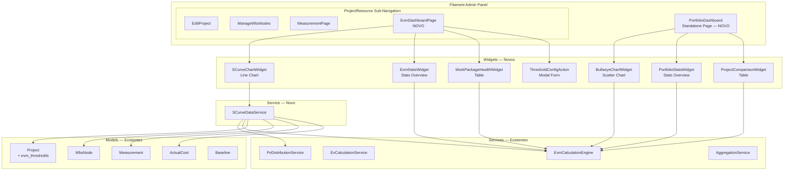
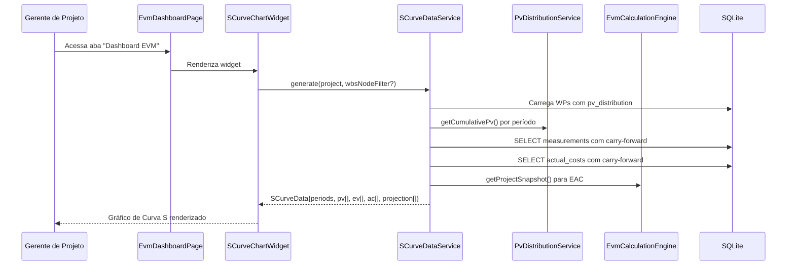
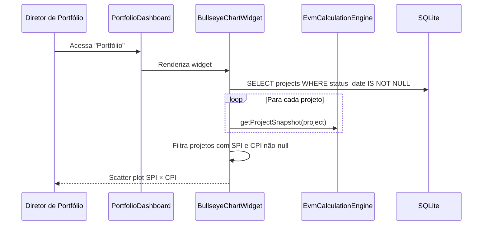
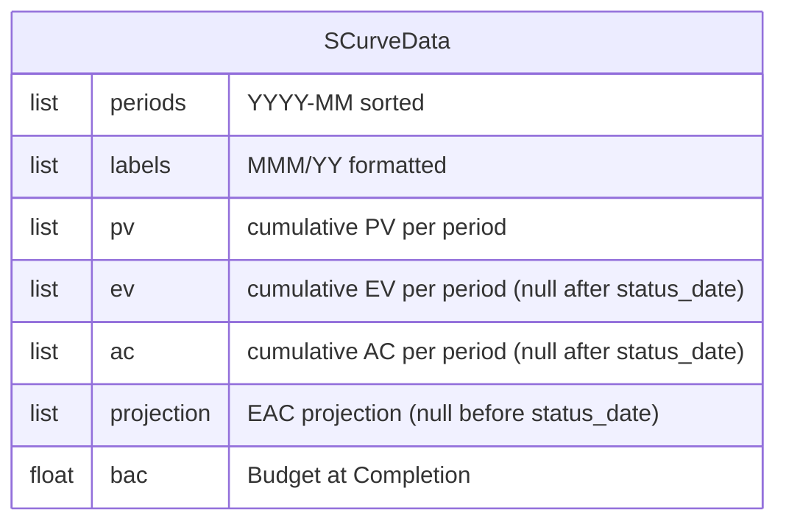
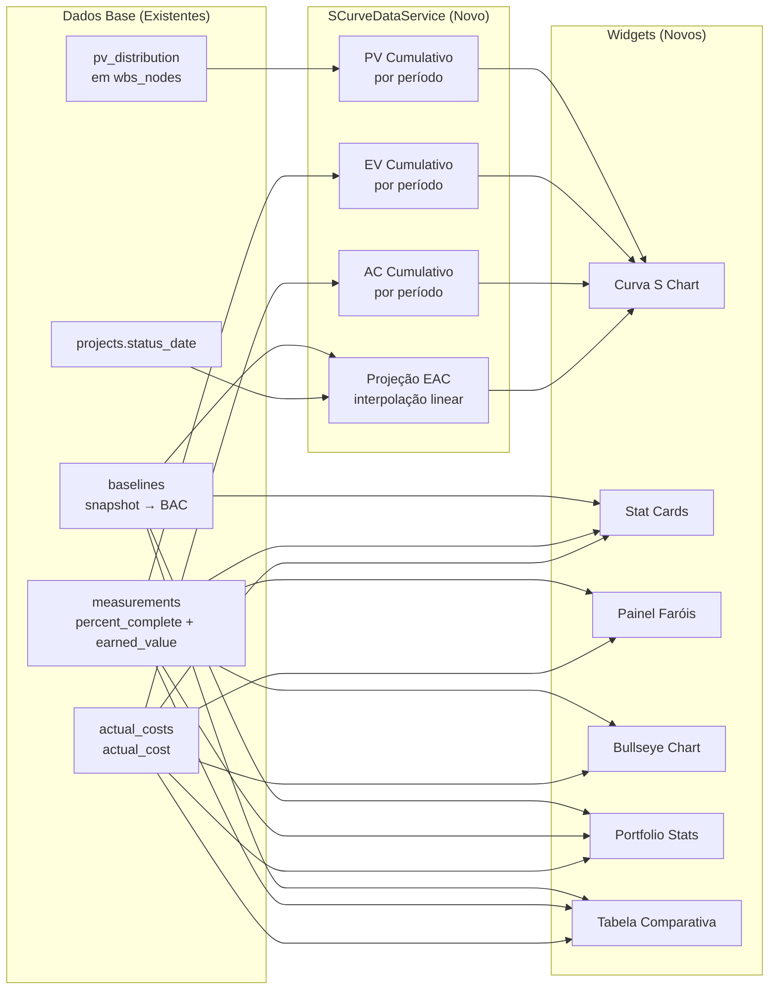

# Design — Módulo de Dashboards e Relatórios (Visualização)

## Overview

Este documento descreve o design técnico do Módulo de Dashboards e Relatórios da plataforma EVM, correspondente ao Módulo 4.4 do PRD. O módulo apresenta visualizações interativas — Curva S, Matriz SPI × CPI (Bullseye Chart), métricas em cards e painel de faróis — que permitem ao Gerente de Projeto e ao Diretor de Portfólio monitorar a saúde dos projetos em tempo real.

O módulo é **puramente de leitura e visualização** — não cria novas tabelas no banco de dados. Toda a lógica de cálculo já existe nos services dos módulos anteriores (`EvmCalculationEngine`, `EvCalculationService`, `PvDistributionService`, `AggregationService`). O único componente novo de lógica é o `SCurveDataService`, que monta séries temporais de PV, EV e AC cumulativos por período mensal para alimentar o gráfico da Curva S.

### Decisões de Design

1. **Filament Chart Widgets (Chart.js) para todos os gráficos**: A Curva S usa `ChartWidget` com `getType() = 'line'` e o Bullseye Chart usa `ChartWidget` com `getType() = 'scatter'`. Ambos são nativos do Filament v5, evitando dependências externas e mantendo consistência visual com o painel. Chart.js suporta scatter plots, linhas tracejadas, linhas de referência (via annotation plugin ou datasets extras), e formatação de tooltips — tudo necessário para os requisitos.

2. **SCurveDataService como service puro**: O `SCurveDataService` é um service stateless que recebe um `Project` (e opcionalmente um `WbsNode` para filtro) e retorna um array estruturado com as séries temporais. Ele reutiliza `PvDistributionService` para PV, queries diretas em `measurements` e `actual_costs` para EV/AC, e `EvmCalculationEngine` para o EAC da projeção. Não persiste nada.

3. **Dashboard EVM como Custom Page no ProjectResource**: A página de dashboard EVM é uma custom page com `InteractsWithRecord`, registrada no `ProjectResource::getPages()` com rota `/{record}/evm-dashboard`. Aparece como aba na sub-navegação horizontal (Top) junto com Editar, EAP, Medições e Baselines. Contém widgets de stats, gráfico da Curva S e tabela de faróis.

4. **Dashboard Portfolio como Filament Page standalone**: A página de portfólio é uma `Page` standalone em `app/Filament/Pages/PortfolioDashboard.php`, acessível no menu principal de navegação. Contém widgets de stats do portfólio, Bullseye Chart e tabela comparativa de projetos.

5. **Limiares configuráveis via coluna JSON no `projects`**: Uma nova coluna nullable `evm_thresholds` (JSON) na tabela `projects` armazena limiares customizados por projeto (`green_threshold`, `yellow_threshold`). Quando null, usa os defaults do `HealthStatus` enum (1.0 e 0.9). Isso é a única alteração de schema — uma migration simples adicionando uma coluna.

6. **Classificação de saúde por WP com limiares customizados**: O `Painel_Farois` classifica cada work package usando os limiares do projeto (customizados ou default). A lógica de classificação é um método helper no `HealthStatus` enum (`fromIndexWithThresholds`) que aceita limiares opcionais, mantendo a lógica centralizada.

7. **Sem polling nos dashboards**: Os dashboards não usam polling automático (`$pollingInterval = null`). Os dados EVM mudam apenas quando o usuário registra medições ou altera a data de status — não há necessidade de atualização em tempo real. O usuário recarrega a página para ver dados atualizados.

8. **Chart.js Annotation Plugin para linhas de referência**: O Bullseye Chart precisa de linhas de referência em SPI=1.0, CPI=1.0, SPI=0.9 e CPI=0.9. Isso é implementado via datasets extras com linhas horizontais/verticais (sem dependência de plugin externo). A Curva S usa um dataset extra para a linha horizontal do BAC.

9. **Projeção EAC como interpolação linear**: A série de projeção no gráfico da Curva S é uma linha tracejada que conecta o ponto AC atual (no período da Data de Status) ao ponto EAC (no período final do projeto). Usa interpolação linear simples entre esses dois pontos.

## Architecture

### Diagrama de Componentes



### Fluxo de Dados — Curva S



### Fluxo de Dados — Bullseye Chart



## Components and Interfaces

### Service — Novo

#### `SCurveDataService`

Service stateless que monta séries temporais de PV, EV e AC cumulativos por período mensal.

```php
class SCurveDataService
{
    public function __construct(
        private PvDistributionService $pvDistributionService,
        private EvmCalculationEngine $evmCalculationEngine,
    ) {}

    /**
     * Gera os dados da Curva S para um projeto.
     *
     * @param  WbsNode|null  $scopeNode  Nó da EAP para filtrar (null = projeto inteiro)
     * @return array{
     *     periods: list<string>,
     *     labels: list<string>,
     *     pv: list<float>,
     *     ev: list<float>,
     *     ac: list<float>,
     *     projection: list<float|null>,
     *     bac: float,
     * }
     */
    public function generate(Project $project, ?WbsNode $scopeNode = null): array;

    /**
     * Calcula PV cumulativo por período para os work packages no escopo.
     *
     * @param  Collection<int, WbsNode>  $workPackages
     * @return array<string, float>  Mapa período => PV cumulativo
     */
    private function buildCumulativePv(Collection $workPackages, array $periods): array;

    /**
     * Calcula EV cumulativo por período com carry-forward.
     *
     * @param  Collection<int, WbsNode>  $workPackages
     * @return array<string, float>  Mapa período => EV cumulativo
     */
    private function buildCumulativeEv(Collection $workPackages, array $periods): array;

    /**
     * Calcula AC cumulativo por período com carry-forward.
     *
     * @param  Collection<int, WbsNode>  $workPackages
     * @return array<string, float>  Mapa período => AC cumulativo
     */
    private function buildCumulativeAc(Collection $workPackages, array $periods): array;

    /**
     * Gera a série de projeção EAC (linha tracejada).
     * Interpola linearmente do AC atual até o EAC no período final.
     *
     * @return list<float|null>  Valores null para períodos antes da Data de Status
     */
    private function buildProjection(
        Project $project,
        array $periods,
        float $currentAc,
        float $eac,
    ): array;

    /**
     * Gera a lista de períodos mensais (YYYY-MM) do início ao fim do projeto.
     *
     * @return list<string>
     */
    private function generatePeriods(Project $project): array;

    /**
     * Converte período "YYYY-MM" para label legível "MMM/YY".
     */
    private function formatLabel(string $period): string;

    /**
     * Coleta os work packages no escopo (projeto inteiro ou descendentes de um nó).
     *
     * @return Collection<int, WbsNode>
     */
    private function getWorkPackagesInScope(Project $project, ?WbsNode $scopeNode): Collection;
}
```

**Formato de retorno do `generate()`:**

```json
{
    "periods": [
        "2025-01",
        "2025-02",
        "2025-03",
        "2025-04",
        "2025-05",
        "2025-06"
    ],
    "labels": ["Jan/25", "Fev/25", "Mar/25", "Abr/25", "Mai/25", "Jun/25"],
    "pv": [10000.0, 25000.0, 45000.0, 70000.0, 90000.0, 100000.0],
    "ev": [8000.0, 20000.0, 38000.0, null, null, null],
    "ac": [9000.0, 22000.0, 42000.0, null, null, null],
    "projection": [null, null, 42000.0, 56000.0, 70000.0, 105333.33],
    "bac": 100000.0
}
```

- `ev` e `ac` são `null` para períodos após a Data de Status (dados futuros não existem).
- `projection` é `null` para períodos antes da Data de Status e contém valores interpolados a partir dela.

### Filament Pages — Novas

#### `EvmDashboardPage`

Custom page dentro do `ProjectResource` com `InteractsWithRecord`.

```php
class EvmDashboardPage extends ManageRelatedRecords
{
    use InteractsWithRecord;

    protected static string $resource = ProjectResource::class;
    protected static string $view = 'filament.resources.projects.pages.evm-dashboard';
    protected static ?string $title = 'Dashboard EVM';
    protected static ?string $navigationLabel = 'Dashboard EVM';
    protected static ?string $navigationIcon = 'heroicon-o-chart-bar';

    // Propriedade Livewire para filtro de nó da EAP
    public ?int $wbsNodeFilter = null;

    // Propriedade Livewire para limiares customizados
    public ?float $greenThreshold = null;
    public ?float $yellowThreshold = null;

    public function mount(int|string $record): void;
    public function getTitle(): string;
    public function getSubheading(): ?string;

    // Action para configurar limiares
    public function configureThresholdsAction(): Action;

    // Dados para os widgets
    public function getWidgetData(): array;
}
```

#### `PortfolioDashboard`

Standalone page no menu principal.

```php
class PortfolioDashboard extends Page
{
    protected static ?string $navigationIcon = 'heroicon-o-chart-pie';
    protected static ?string $navigationLabel = 'Portfólio';
    protected static ?string $title = 'Dashboard do Portfólio';
    protected static ?int $navigationSort = 1;
    protected static string $view = 'filament.pages.portfolio-dashboard';

    public static function canAccess(): bool;  // PM e Director
}
```

### Filament Widgets — Novos

| Widget                    | Tipo                  | Página             | Descrição                                                                                            |
| ------------------------- | --------------------- | ------------------ | ---------------------------------------------------------------------------------------------------- |
| `SCurveChartWidget`       | `ChartWidget`         | EvmDashboardPage   | Gráfico de linhas: PV (azul), EV (verde), AC (vermelho), Projeção EAC (tracejada), BAC (horizontal). |
| `EvmStatsWidget`          | `StatsOverviewWidget` | EvmDashboardPage   | Cards com PV, EV, AC, BAC, SV, CV, SPI, CPI, EAC, ETC, VAC, TCPI e HealthStatus.                     |
| `WorkPackageHealthWidget` | `Widget` (custom)     | EvmDashboardPage   | Tabela de WPs com farol, ordenada por severidade. Filtro por HealthStatus.                           |
| `BullseyeChartWidget`     | `ChartWidget`         | PortfolioDashboard | Scatter plot SPI × CPI com linhas de referência em 1.0 e 0.9.                                        |
| `PortfolioStatsWidget`    | `StatsOverviewWidget` | PortfolioDashboard | Cards com métricas consolidadas do portfólio + contagem por HealthStatus.                            |
| `ProjectComparisonWidget` | `Widget` (custom)     | PortfolioDashboard | Tabela comparativa de projetos com todas as métricas EVM. Sortable.                                  |

### Interface do `SCurveChartWidget`

```php
class SCurveChartWidget extends ChartWidget
{
    protected static ?string $heading = 'Curva S';
    protected static ?string $pollingInterval = null;

    public ?int $projectId = null;
    public ?int $wbsNodeFilter = null;

    protected function getType(): string { return 'line'; }

    protected function getData(): array;  // Retorna datasets Chart.js

    protected function getOptions(): array;  // Formatação BRL no eixo Y, labels MMM/YY no eixo X

    // Mensagem quando não há dados
    protected function getEmptyStateDescription(): ?string;
}
```

### Interface do `BullseyeChartWidget`

```php
class BullseyeChartWidget extends ChartWidget
{
    protected static ?string $heading = 'Matriz SPI × CPI';
    protected static ?string $pollingInterval = null;

    protected function getType(): string { return 'scatter'; }

    protected function getData(): array;  // Datasets com pontos coloridos por HealthStatus

    protected function getOptions(): array;  // Linhas de referência, tooltips com nome do projeto
}
```

### Extensões em Componentes Existentes

| Componente           | Alteração                                                                                                   |
| -------------------- | ----------------------------------------------------------------------------------------------------------- |
| `ProjectResource`    | Adiciona `EvmDashboardPage` em `getPages()` e `getRecordSubNavigation()`.                                   |
| `Project` model      | Adiciona `evm_thresholds` ao `$fillable` e ao `casts()` como `'array'`.                                     |
| `HealthStatus` enum  | Adiciona método estático `fromIndexWithThresholds(?float $index, float $green, float $yellow): self`.       |
| `AdminPanelProvider` | O `discoverPages()` já cobre `app/Filament/Pages`, então `PortfolioDashboard` é registrado automaticamente. |

## Data Models

### Nenhuma Nova Tabela

Este módulo **não cria novas tabelas** no banco de dados. Toda a visualização é construída a partir dos dados existentes nas tabelas `projects`, `wbs_nodes`, `baselines`, `measurements` e `actual_costs`.

### Única Alteração de Schema

#### Alteração em `projects` — adicionar `evm_thresholds`

| Coluna           | Tipo | Constraints | Descrição                                                      |
| ---------------- | ---- | ----------- | -------------------------------------------------------------- |
| `evm_thresholds` | json | nullable    | Limiares customizados para classificação semafórica do projeto |

**Formato do JSON `evm_thresholds`:**

```json
{
    "green_threshold": 0.95,
    "yellow_threshold": 0.85
}
```

**Regras de validação:**

- `green_threshold` deve ser > `yellow_threshold`
- Ambos devem ser valores numéricos positivos
- Quando `null`, usa os defaults do `HealthStatus` enum (green ≥ 1.0, yellow ≥ 0.9)

**Migration:**

```php
Schema::table('projects', function (Blueprint $table) {
    $table->json('evm_thresholds')->nullable()->after('active_baseline_id');
});
```

### Extensão do Model `Project`

```php
// Adicionar ao $fillable
'evm_thresholds',

// Adicionar ao casts()
'evm_thresholds' => 'array',

// Novo método helper
public function getGreenThreshold(): float
{
    return $this->evm_thresholds['green_threshold'] ?? HealthStatus::GREEN_THRESHOLD;
}

public function getYellowThreshold(): float
{
    return $this->evm_thresholds['yellow_threshold'] ?? HealthStatus::YELLOW_THRESHOLD;
}
```

### Extensão do Enum `HealthStatus`

```php
/**
 * Classifica um índice usando limiares customizados.
 */
public static function fromIndexWithThresholds(
    ?float $index,
    float $greenThreshold = self::GREEN_THRESHOLD,
    float $yellowThreshold = self::YELLOW_THRESHOLD,
): self {
    if ($index === null) {
        return self::Gray;
    }
    if ($index >= $greenThreshold) {
        return self::Green;
    }
    if ($index >= $yellowThreshold) {
        return self::Yellow;
    }
    return self::Red;
}
```

### Estrutura de Dados do SCurveDataService



### Diagrama de Dependência de Dados



## Correctness Properties

_A property is a characteristic or behavior that should hold true across all valid executions of a system — essentially, a formal statement about what the system should do. Properties serve as the bridge between human-readable specifications and machine-verifiable correctness guarantees._

### Property 1: SCurve cumulative data correctness

_For any_ project with an active frozen baseline, a defined status date, and work packages with PV distributions, measurements, and actual costs, the `SCurveDataService::generate()` method SHALL return:

- Cumulative PV at each period equal to the sum of all work package PV distribution values up to and including that period
- Cumulative EV at each period equal to the sum of earned values from measurements at or before that period, using carry-forward for periods without explicit measurements
- Cumulative AC at each period equal to the sum of actual costs recorded at or before that period, using carry-forward for periods without explicit records
- All three series SHALL be monotonically non-decreasing (cumulative values never decrease)

**Validates: Requirements 1.1, 1.2, 1.3, 1.4**

### Property 2: SCurve projection endpoint equals EAC

_For any_ project with valid EVM data (active baseline, status date, at least one measurement), the last non-null value in the projection series returned by `SCurveDataService::generate()` SHALL equal the EAC value calculated by `EvmCalculationEngine::getProjectSnapshot()` for the same project (within floating-point tolerance of 0.01).

**Validates: Requirements 1.6**

### Property 3: Period format and chronological ordering

_For any_ project with planned start and end dates, the periods array returned by `SCurveDataService::generate()` SHALL contain strings in "YYYY-MM" format, sorted in ascending chronological order, with the first period matching the project's planned start month and the last period matching the project's planned end month. The corresponding labels array SHALL contain strings in "MMM/YY" format (pt-BR locale) in the same order.

**Validates: Requirements 1.7, 2.6**

### Property 4: Stats widget metric completeness

_For any_ valid `EvmSnapshot` (including snapshots with null SPI, CPI, and/or TCPI), the `EvmStatsWidget` SHALL produce stat entries for all 12 required metrics: PV, EV, AC, BAC, SV, CV, SPI, CPI, EAC, ETC, VAC, and TCPI. Monetary metrics SHALL be formatted in BRL notation, index metrics SHALL display with 4 decimal places when non-null and "N/D" when null.

**Validates: Requirements 3.1, 3.4, 3.5, 3.6**

### Property 5: Bullseye chart plots eligible projects with correct colors

_For any_ set of projects where some have valid SPI and CPI (non-null, with status_date defined) and some do not, the `BullseyeChartWidget` SHALL plot exactly one point per eligible project (those with non-null SPI AND non-null CPI AND defined status_date). Each point's color SHALL match the project's `OverallHealth` classification: green for Green, yellow for Yellow, red for Red, gray for Gray. Projects with null SPI or null CPI SHALL be excluded.

**Validates: Requirements 4.1, 4.3, 4.5**

### Property 6: Portfolio health status counts

_For any_ set of projects with various `OverallHealth` classifications, the `PortfolioStatsWidget` SHALL display a count per HealthStatus category (Green, Yellow, Red, Gray) where the sum of all counts equals the total number of projects with a defined status date, and each individual count matches the actual number of projects with that classification.

**Validates: Requirements 5.2**

### Property 7: Work package health classification and severity ordering

_For any_ project with work packages that have various CPI values (including null), the `WorkPackageHealthWidget` SHALL:

- Classify each work package using the project's thresholds (custom or default): Green when CPI ≥ green_threshold, Yellow when CPI ≥ yellow_threshold, Red when CPI < yellow_threshold, Gray when CPI is null
- Sort work packages by severity: Red first, then Yellow, then Green, then Gray
- Display for each work package: name, code, percent complete, EV, AC, CPI, and HealthStatus icon with color

**Validates: Requirements 6.1, 6.2, 6.3, 6.4, 6.5, 6.6, 6.7**

### Property 8: Custom threshold classification and validation

_For any_ pair of threshold values (green_threshold, yellow_threshold), the system SHALL:

- Accept the configuration if and only if green_threshold > yellow_threshold (both positive)
- Reject configurations where green_threshold ≤ yellow_threshold with a validation error
- When accepted, `HealthStatus::fromIndexWithThresholds()` SHALL classify any index ≥ green_threshold as Green, any index ≥ yellow_threshold (but < green_threshold) as Yellow, any index < yellow_threshold as Red, and null as Gray

**Validates: Requirements 7.2, 7.3, 7.4**

### Property 9: Scoped SCurve data includes only descendant work packages

_For any_ WBS tree and _for any_ non-leaf node selected as scope filter, the `SCurveDataService::generate(project, scopeNode)` SHALL return cumulative PV, EV, and AC values computed only from the descendant work packages of the selected node. The values SHALL NOT include contributions from work packages outside the selected subtree.

**Validates: Requirements 9.2**

### Property 10: Project comparison table completeness

_For any_ set of projects (including projects without status_date), the `ProjectComparisonWidget` SHALL display one row per project with columns: project name, status date, BAC, PV, EV, AC, SV, CV, SPI, CPI, EAC, VAC, and OverallHealth. Projects without status_date SHALL display "Sem Data de Status" and zero values for all metrics.

**Validates: Requirements 10.1, 10.5**

## Error Handling

### Dados Ausentes

| Cenário                                       | Comportamento                                                                                           |
| --------------------------------------------- | ------------------------------------------------------------------------------------------------------- |
| Projeto sem `status_date`                     | `SCurveDataService::generate()` retorna array vazio. Widgets exibem mensagem de estado vazio.           |
| Projeto sem Baseline ativa                    | `SCurveDataService::generate()` retorna array vazio. `EvmCalculationEngine` retorna snapshot zerado.    |
| Projeto sem work packages                     | `SCurveDataService::generate()` retorna períodos com valores zero. Painel de faróis exibe tabela vazia. |
| Work package sem medição na Data de Status    | Carry-forward: usa última medição anterior. Se nenhuma existe, EV = 0.                                  |
| Work package sem custo real na Data de Status | Carry-forward: usa último custo anterior. Se nenhum existe, AC = 0.                                     |
| Nenhum projeto com `status_date` no portfólio | Portfolio snapshot zerado com HealthStatus Gray. Bullseye Chart exibe mensagem de estado vazio.         |
| Projeto com SPI ou CPI null                   | Excluído do Bullseye Chart. Incluído na tabela comparativa com "N/D" para índices null.                 |

### Erros de Validação

| Cenário                                                | Comportamento                                                                                       |
| ------------------------------------------------------ | --------------------------------------------------------------------------------------------------- |
| `green_threshold` ≤ `yellow_threshold` na configuração | Rejeita com `Notification::make()->danger()`: "O limiar Verde deve ser maior que o limiar Amarelo." |
| Limiares negativos ou zero                             | Rejeita com validação no formulário: valores devem ser positivos.                                   |
| Filtro de nó EAP com ID inválido                       | Ignora o filtro e retorna dados do projeto inteiro.                                                 |

### Erros de Integração

| Cenário                                              | Comportamento                                                                      |
| ---------------------------------------------------- | ---------------------------------------------------------------------------------- |
| Falha ao obter BAC da Baseline (snapshot corrompido) | Propaga exceção do `EvmCalculationEngine`. Widget exibe mensagem de erro genérica. |
| Falha ao calcular EAC para projeção                  | Projeção omitida do gráfico. Demais séries (PV, EV, AC) exibidas normalmente.      |
| Timeout em query com muitos work packages            | Não esperado com SQLite local. Se ocorrer, erro 500 padrão do Laravel.             |

### Padrão de Tratamento

- O `SCurveDataService` **não lança exceções** para dados ausentes — retorna arrays vazios ou valores zero.
- Exceções são lançadas apenas para erros de integração (Baseline corrompida, dados inconsistentes).
- Widgets capturam exceções e exibem mensagens de estado vazio em vez de erros 500.
- Validação de limiares usa `Notification::make()->danger()` seguindo o padrão do projeto.
- Todas as operações são somente leitura — não há necessidade de `DB::transaction()`.

## Testing Strategy

### Abordagem Dual: Unit Tests + Property Tests

Este módulo combina testes unitários (exemplos específicos e edge cases) com testes baseados em propriedades (verificação universal). O `SCurveDataService` é o componente com maior complexidade lógica e se beneficia fortemente de property-based testing. Os widgets são testados com exemplos específicos e smoke tests.

### Property-Based Tests (Pest + Datasets com Geradores)

**Biblioteca:** Pest v4 com `repeat()` e datasets gerados por Faker/generators customizados
**Mínimo de iterações:** 100 por property test
**Tag format:** Comentário `// Feature: evm-dashboards, Property {N}: {title}`

#### Geradores Customizados

Os testes utilizarão geradores que produzem:

- **Projects com EVM data**: Projetos com datas planejadas aleatórias (3-24 meses de duração), baseline congelada, status_date dentro do intervalo, e work packages com PV distributions, measurements e actual costs em períodos variados.
- **WBS trees com métricas**: Árvores aleatórias com 2-3 níveis, 2-5 filhos por nó, e valores PV/EV/AC atribuídos aos work packages folha.
- **CPI values**: Valores float incluindo < 0.9, [0.9, 1.0), ≥ 1.0, e null (AC = 0).
- **Threshold pairs**: Pares (green, yellow) com green > yellow (válidos) e green ≤ yellow (inválidos).
- **EvmSnapshot instances**: Snapshots com valores aleatórios incluindo nulls para SPI, CPI, TCPI.

#### Properties a Implementar

| Property                                | Arquivo de Teste                                | Estratégia                                                                                                |
| --------------------------------------- | ----------------------------------------------- | --------------------------------------------------------------------------------------------------------- |
| P1: SCurve cumulative data              | `tests/Unit/SCurveDataServiceTest.php`          | Gerar projetos com WPs e medições aleatórias, verificar PV cumulativo = soma running, EV/AC carry-forward |
| P2: Projection endpoint = EAC           | `tests/Unit/SCurveDataServiceTest.php`          | Gerar projetos com dados válidos, comparar último valor da projeção com EAC do engine                     |
| P3: Period format and ordering          | `tests/Unit/SCurveDataServiceTest.php`          | Gerar projetos com datas variadas, verificar formato YYYY-MM e ordenação                                  |
| P4: Stats metric completeness           | `tests/Feature/EvmStatsWidgetTest.php`          | Gerar EvmSnapshots aleatórios, verificar 12 métricas presentes com formatação correta                     |
| P5: Bullseye eligible projects          | `tests/Feature/BullseyeChartWidgetTest.php`     | Gerar conjuntos de projetos com SPI/CPI variados, verificar contagem e cores                              |
| P6: Portfolio health counts             | `tests/Feature/PortfolioStatsWidgetTest.php`    | Gerar projetos com HealthStatus variados, verificar contagens por categoria                               |
| P7: WP health classification + ordering | `tests/Feature/WorkPackageHealthWidgetTest.php` | Gerar WPs com CPI variados, verificar classificação e ordenação por severidade                            |
| P8: Custom threshold classification     | `tests/Unit/HealthStatusTest.php`               | Gerar pares de limiares e índices, verificar classificação e validação                                    |
| P9: Scoped SCurve data                  | `tests/Unit/SCurveDataServiceTest.php`          | Gerar árvores EAP, selecionar nó, verificar que apenas descendentes contribuem                            |
| P10: Project comparison completeness    | `tests/Feature/ProjectComparisonWidgetTest.php` | Gerar projetos com/sem status_date, verificar colunas e valores                                           |

### Unit Tests (Exemplos e Edge Cases)

| Área                    | Arquivo                                         | Cenários                                                                                        |
| ----------------------- | ----------------------------------------------- | ----------------------------------------------------------------------------------------------- |
| SCurveDataService       | `tests/Unit/SCurveDataServiceTest.php`          | Projeto sem baseline (retorna vazio), projeto sem status_date (retorna vazio), projeto com 1 WP |
| EvmDashboardPage        | `tests/Feature/EvmDashboardPageTest.php`        | Renderização da página, sub-navegação, filtro de nó EAP, configuração de limiares               |
| PortfolioDashboard      | `tests/Feature/PortfolioDashboardTest.php`      | Renderização da página, navegação principal, acesso PM vs Director                              |
| SCurveChartWidget       | `tests/Feature/SCurveChartWidgetTest.php`       | Datasets corretos (4 séries + BAC), estado vazio, formatação BRL                                |
| BullseyeChartWidget     | `tests/Feature/BullseyeChartWidgetTest.php`     | Linhas de referência em 1.0 e 0.9, estado vazio, tooltips com nome do projeto                   |
| WorkPackageHealthWidget | `tests/Feature/WorkPackageHealthWidgetTest.php` | Filtro por HealthStatus, limiares customizados vs default                                       |
| Threshold validation    | `tests/Feature/EvmDashboardPageTest.php`        | green > yellow aceito, green ≤ yellow rejeitado, valores negativos rejeitados                   |
| Autorização             | `tests/Feature/DashboardAuthorizationTest.php`  | PM acessa próprios projetos, Director acessa todos, PM acessa portfólio                         |

### Filament-Specific Tests

Utilizar `pestphp/pest-plugin-livewire` para testar:

- Renderização de páginas customizadas (EvmDashboardPage, PortfolioDashboard)
- Widgets renderizam sem erros com dados válidos e com dados ausentes
- Actions (configuração de limiares) funcionam corretamente
- Sub-navegação inclui a aba "Dashboard EVM"
- Navegação principal inclui "Portfólio"
- Autorização por role (PM vs Director)

### Cobertura Esperada

- **SCurveDataService:** 100% via property tests + unit tests (edge cases)
- **HealthStatus::fromIndexWithThresholds:** 100% via property tests
- **Widgets (stats, charts, tables):** 90%+ via feature tests + property tests
- **Pages (EvmDashboardPage, PortfolioDashboard):** Smoke tests para renderização + testes de autorização
- **Threshold validation:** 100% via property tests + unit tests
- **Migration (evm_thresholds):** Coberta implicitamente pelos testes que usam a coluna
