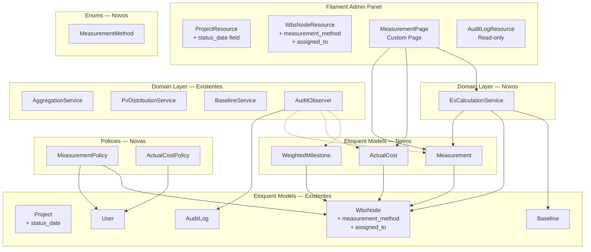
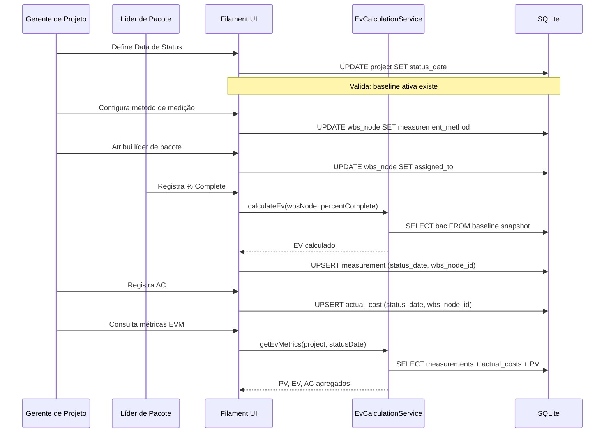
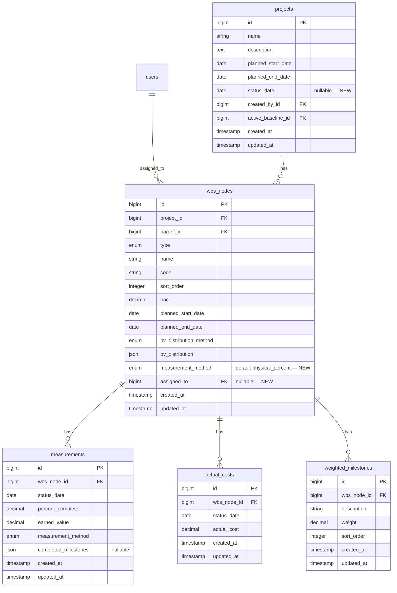

# Design — Módulo de Apontamento e Medição (Execução)

## Overview

Este documento descreve o design técnico do Módulo de Apontamento e Medição da plataforma EVM. O módulo coleta os dados reais de execução do projeto — percentual de conclusão (% Complete) e custo real (AC — Actual Cost) — e calcula o Earned Value (EV) para alimentar o motor de cálculo EVM.

O módulo **estende** a arquitetura existente do Módulo de Estruturação e Baseline (`project-structuring-baseline`), reutilizando os models `Project`, `WbsNode`, `Baseline`, `AuditLog` e `User`, os services `AggregationService`, `PvDistributionService` e `BaselineService`, o `AuditObserver`, e as policies existentes. Não recria nenhuma dessas entidades.

### Decisões de Design

1. **Status Date no Project**: A Data de Status é armazenada diretamente na tabela `projects` como coluna `status_date` (nullable). Isso simplifica a consulta e garante que todos os cálculos EVM de um projeto referenciem a mesma data. Só pode ser definida quando há Baseline congelada ativa.

2. **Measurement Method no WbsNode**: O método de medição (`measurement_method`) é armazenado na tabela `wbs_nodes` como coluna enum. Não faz parte do snapshot da Baseline, permitindo alteração sem necessidade de nova versão. O default é `physical_percent`.

3. **Assigned To no WbsNode**: O líder de pacote (`assigned_to`) é armazenado como FK nullable na tabela `wbs_nodes`, apontando para `users.id`. Relação 1:1 (um líder por pacote), mas um usuário pode liderar múltiplos pacotes.

4. **Tabelas separadas para Measurement e ActualCost**: `measurements` e `actual_costs` são tabelas independentes, cada uma com chave única composta `(wbs_node_id, status_date)`. Isso respeita a regra de negócio de que AC é input independente do % Complete, e permite upsert natural via `updateOrCreate`.

5. **Weighted Milestones como tabela própria**: `weighted_milestones` é uma tabela separada vinculada ao `wbs_node_id`, com `description`, `weight` e `sort_order`. Os marcos concluídos são armazenados como JSON na tabela `measurements` (`completed_milestones`), contendo os IDs dos marcos concluídos.

6. **EV calculado e armazenado no Measurement**: O EV é calculado no momento do registro (`BAC × % Complete / 100`) e persistido na coluna `earned_value` do `measurements`. Isso evita recálculos e preserva o histórico mesmo se a Baseline mudar no futuro.

7. **Carry-forward via query**: Quando não há registro para a Data de Status atual, o sistema busca o último registro anterior via subquery `MAX(status_date) WHERE status_date <= ?`. Não duplica registros — a lógica é puramente de leitura.

8. **Imutabilidade de registros históricos**: Registros de medição e custo real só podem ser editados se `status_date == project.status_date`. Registros de datas anteriores são somente leitura. Essa regra é enforced no model via `booted()` e na policy.

9. **EV Calculation Service**: Um novo `EvCalculationService` centraliza o cálculo de EV, a agregação bottom-up de EV por nó da EAP, e a lógica de carry-forward. Reutiliza o padrão de agregação do `AggregationService` existente.

10. **Extensão do AuditObserver**: O `AuditObserver` existente é reutilizado via `#[ObservedBy]` nos novos models (`Measurement`, `ActualCost`, `WeightedMilestone`), registrando automaticamente criações e atualizações na `audit_logs`.

## Architecture

### Diagrama de Componentes (Extensão)



### Fluxo de Dados Principal



## Components and Interfaces

### Models — Novos

| Model               | Responsabilidade                                                                                                                 |
| ------------------- | -------------------------------------------------------------------------------------------------------------------------------- |
| `Measurement`       | Registro de medição: % Complete e EV calculado de um work package em uma Data de Status. Chave única (wbs_node_id, status_date). |
| `ActualCost`        | Registro de custo real (AC) de um work package em uma Data de Status. Chave única (wbs_node_id, status_date).                    |
| `WeightedMilestone` | Marco ponderado de um work package (método Marcos Ponderados). Descrição, peso e ordem.                                          |

### Models — Estendidos

| Model     | Extensão                                                                                                                       |
| --------- | ------------------------------------------------------------------------------------------------------------------------------ |
| `Project` | Nova coluna `status_date` (date, nullable). Validação: só pode ser definida com baseline ativa.                                |
| `WbsNode` | Novas colunas `measurement_method` (enum, default physical_percent) e `assigned_to` (FK users, nullable). Novos relationships. |
| `User`    | Novo relationship `assignedWorkPackages()`.                                                                                    |

### Services — Novos

| Service                | Responsabilidade                                                                                                                                    |
| ---------------------- | --------------------------------------------------------------------------------------------------------------------------------------------------- |
| `EvCalculationService` | Calcula EV (BAC × % Complete / 100). Agrega EV bottom-up na árvore EAP. Implementa carry-forward para pacotes sem registro na Data de Status atual. |

### Filament — Extensões e Novos

| Componente                   | Tipo        | Descrição                                                                                                                                |
| ---------------------------- | ----------- | ---------------------------------------------------------------------------------------------------------------------------------------- |
| `ProjectResource` (extensão) | Resource    | Adiciona campo `status_date` no formulário de edição. Exibe Data de Status na listagem.                                                  |
| `WbsNodeResource` (extensão) | Resource    | Adiciona campos `measurement_method` e `assigned_to`. Relation manager para `WeightedMilestone`.                                         |
| `MeasurementPage`            | Custom Page | Página de apontamento de medição. Lista work packages com filtro por líder. Formulário adaptativo por método de medição. Registro de AC. |

### Policies — Novas

| Policy              | Regras                                                                                                                                             |
| ------------------- | -------------------------------------------------------------------------------------------------------------------------------------------------- |
| `MeasurementPolicy` | PM: create/update em qualquer WP. Líder: create/update apenas nos WPs atribuídos. Director: viewAny/view. Bloqueia edição de registros históricos. |
| `ActualCostPolicy`  | PM: create/update em qualquer WP. Líder: sem acesso a AC. Director: viewAny/view. Bloqueia edição de registros históricos.                         |

### Enums — Novos

| Enum                | Valores                                                                  | Labels pt-BR                                               |
| ------------------- | ------------------------------------------------------------------------ | ---------------------------------------------------------- |
| `MeasurementMethod` | `zero_hundred`, `fifty_fifty`, `weighted_milestones`, `physical_percent` | "0/100", "50/50", "Marcos Ponderados", "Percentual Físico" |

## Data Models

### Diagrama ER (Extensão)



### Detalhamento das Novas Tabelas e Alterações

#### Alteração em `projects` — adicionar `status_date`

| Coluna        | Tipo | Constraints | Descrição                        |
| ------------- | ---- | ----------- | -------------------------------- |
| `status_date` | date | nullable    | Data de Status para cálculos EVM |

**Validações no model:**

- `status_date` >= `planned_start_date`
- `status_date` <= `planned_end_date`
- Só pode ser definida se `active_baseline_id` não é null e a baseline está frozen

#### Alteração em `wbs_nodes` — adicionar `measurement_method` e `assigned_to`

| Coluna               | Tipo   | Constraints                               | Descrição                               |
| -------------------- | ------ | ----------------------------------------- | --------------------------------------- |
| `measurement_method` | string | default 'physical_percent'                | Método de medição do pacote de trabalho |
| `assigned_to`        | bigint | FK users.id, nullable, set null on delete | Líder de pacote responsável             |

**Nota:** `measurement_method` só é relevante para `type = work_package`. Para outros tipos, é ignorado.

#### `measurements`

| Coluna                 | Tipo          | Constraints                     | Descrição                                            |
| ---------------------- | ------------- | ------------------------------- | ---------------------------------------------------- |
| `id`                   | bigint        | PK, auto                        | Identificador único                                  |
| `wbs_node_id`          | bigint        | FK wbs_nodes.id, cascade delete | Pacote de trabalho medido                            |
| `status_date`          | date          | required                        | Data de Status da medição                            |
| `percent_complete`     | decimal(5,2)  | required, 0.00–100.00           | Percentual de conclusão                              |
| `earned_value`         | decimal(15,2) | required                        | EV calculado (BAC × % Complete / 100)                |
| `measurement_method`   | string        | required                        | Método utilizado nesta medição                       |
| `completed_milestones` | json          | nullable                        | IDs dos marcos concluídos (método Marcos Ponderados) |
| `created_at`           | timestamp     | auto                            |                                                      |
| `updated_at`           | timestamp     | auto                            |                                                      |

**Unique constraint:** `(wbs_node_id, status_date)` — no máximo um registro por pacote por data de status.

**Formato do JSON `completed_milestones`:**

```json
[1, 3, 5]
```

Array de IDs de `weighted_milestones` que foram concluídos.

#### `actual_costs`

| Coluna        | Tipo          | Constraints                     | Descrição                 |
| ------------- | ------------- | ------------------------------- | ------------------------- |
| `id`          | bigint        | PK, auto                        | Identificador único       |
| `wbs_node_id` | bigint        | FK wbs_nodes.id, cascade delete | Pacote de trabalho        |
| `status_date` | date          | required                        | Data de Status            |
| `actual_cost` | decimal(15,2) | required, >= 0                  | Custo real incorrido (AC) |
| `created_at`  | timestamp     | auto                            |                           |
| `updated_at`  | timestamp     | auto                            |                           |

**Unique constraint:** `(wbs_node_id, status_date)` — no máximo um registro por pacote por data de status.

#### `weighted_milestones`

| Coluna        | Tipo         | Constraints                     | Descrição                |
| ------------- | ------------ | ------------------------------- | ------------------------ |
| `id`          | bigint       | PK, auto                        | Identificador único      |
| `wbs_node_id` | bigint       | FK wbs_nodes.id, cascade delete | Pacote de trabalho       |
| `description` | string(255)  | required                        | Descrição do marco       |
| `weight`      | decimal(5,2) | required, > 0                   | Peso percentual do marco |
| `sort_order`  | integer      | required, default 0             | Ordem de exibição        |
| `created_at`  | timestamp    | auto                            |                          |
| `updated_at`  | timestamp    | auto                            |                          |

**Validação:** A soma dos `weight` de todos os milestones de um `wbs_node_id` deve ser exatamente 100.00.

### Indexes

- `measurements`: unique index em `(wbs_node_id, status_date)`
- `measurements`: index em `(wbs_node_id, status_date DESC)` para carry-forward queries
- `actual_costs`: unique index em `(wbs_node_id, status_date)`
- `actual_costs`: index em `(wbs_node_id, status_date DESC)` para carry-forward queries
- `weighted_milestones`: index em `(wbs_node_id, sort_order)`
- `wbs_nodes`: index em `assigned_to` para filtrar pacotes por líder

## Correctness Properties

_A property is a characteristic or behavior that should hold true across all valid executions of a system — essentially, a formal statement about what the system should do. Properties serve as the bridge between human-readable specifications and machine-verifiable correctness guarantees._

### Property 1: Status date range validation

_For any_ project with planned start and end dates, and _for any_ candidate status date, the system SHALL accept the status date if and only if it falls within the inclusive range [planned_start_date, planned_end_date]. Dates outside this range SHALL be rejected.

**Validates: Requirements 1.2, 1.3**

### Property 2: Status date requires active frozen baseline

_For any_ project, setting a status date SHALL succeed only if the project has an active baseline with status "frozen". If no active frozen baseline exists, the operation SHALL be rejected regardless of the date value.

**Validates: Requirements 1.4**

### Property 3: Measurement method constrains allowed percent complete values

_For any_ work package and _for any_ percent complete value, the system SHALL enforce method-specific constraints: for `zero_hundred`, only 0 and 100 are accepted; for `fifty_fifty`, only 0, 50, and 100 are accepted; for `physical_percent`, any value in [0.00, 100.00] with up to two decimal places is accepted. Values outside the allowed set for the configured method SHALL be rejected.

**Validates: Requirements 4.1, 4.2, 4.3, 4.5**

### Property 4: Weighted milestones percent complete calculation

_For any_ work package using the `weighted_milestones` method with a set of milestones whose weights sum to 100, and _for any_ subset of those milestones marked as completed, the calculated percent complete SHALL equal the sum of the weights of the completed milestones.

**Validates: Requirements 4.4**

### Property 5: Progress monotonicity (non-regression)

_For any_ work package with an existing measurement at a previous status date, a new measurement SHALL be accepted only if its percent complete is greater than or equal to the percent complete of the most recent prior measurement. Attempts to register a lower percent complete SHALL be rejected.

**Validates: Requirements 4.6**

### Property 6: EV calculation formula

_For any_ work package with a BAC defined in the active baseline and _for any_ valid percent complete value, the earned value (EV) SHALL be calculated as `BAC × (percent_complete / 100)`. When BAC is zero or null, EV SHALL be zero regardless of percent complete. When percent complete is 100%, EV SHALL equal BAC. When percent complete is 0%, EV SHALL be zero.

**Validates: Requirements 4.7, 7.1, 7.4, 7.5, 7.6**

### Property 7: Measurement and actual cost upsert behavior

_For any_ work package and status date combination, creating a measurement (or actual cost) record when one already exists for that combination SHALL update the existing record rather than creating a duplicate. After the operation, there SHALL be exactly one record per (wbs_node_id, status_date) pair.

**Validates: Requirements 4.10, 5.4**

### Property 8: Actual cost non-negative validation

_For any_ actual cost value submitted, the system SHALL accept the value if and only if it is a numeric value greater than or equal to zero with at most two decimal places. Negative values SHALL be rejected.

**Validates: Requirements 5.2**

### Property 9: Historical record immutability

_For any_ measurement or actual cost record whose status_date is strictly earlier than the project's current status_date, all update attempts SHALL be rejected. Only records where status_date equals the project's current status_date SHALL be editable.

**Validates: Requirements 1.5, 6.1, 6.2, 6.3, 6.4**

### Property 10: EV bottom-up aggregation

_For any_ valid WBS tree with EV values on work packages (from measurements at a given status date, including carry-forward), the EV of any non-leaf node SHALL equal the sum of the EVs of its descendant work packages. The project-level EV SHALL equal the sum of EVs of all leaf work packages.

**Validates: Requirements 7.2, 7.3**

### Property 11: Carry-forward for missing records

_For any_ work package that has measurement (or actual cost) records at earlier status dates but not at the current project status date, the system SHALL return the value from the most recent prior status date. If no prior record exists, the system SHALL return zero (0% complete / zero AC).

**Validates: Requirements 8.4, 8.5**

### Property 12: EVM data synchronization on single status date

_For any_ project with a defined status date, all EVM metric queries (PV, EV, AC) SHALL use the same status date value — the project's current status_date. The system SHALL NOT mix values from different status dates in a single metric calculation.

**Validates: Requirements 8.1**

### Property 13: Mutations produce audit logs

_For any_ create or update operation on Measurement, ActualCost, or WeightedMilestone models, and _for any_ change to Project.status_date or WbsNode.measurement_method, the system SHALL create an audit log entry containing the user ID, timestamp, operation type, and the old/new values.

**Validates: Requirements 9.1, 9.2, 9.3, 9.4**

### Property 14: RBAC enforcement for measurements and costs

_For any_ user and work package combination: a user with role `project_manager` SHALL be allowed to create/update measurements and actual costs on any work package; a user assigned as leader (`assigned_to`) of a work package SHALL be allowed to create/update measurements only on their assigned work packages and SHALL be denied actual cost operations; a user with role `portfolio_director` SHALL be allowed only read operations on measurements and actual costs.

**Validates: Requirements 10.1, 10.2, 10.3, 10.4, 10.5**

### Property 15: Milestone weight validation and sum invariant

_For any_ set of weighted milestones belonging to a work package, each individual weight SHALL be a positive numeric value with at most two decimal places, and the sum of all weights SHALL equal exactly 100.00. Sets that violate either constraint SHALL be rejected.

**Validates: Requirements 2.4, 12.2, 12.3**

### Property 16: Completed milestone serialization round-trip

_For any_ valid array of completed milestone IDs, serializing to JSON and then deserializing SHALL produce an array equivalent to the original. The serialized format SHALL be a JSON array of milestone IDs.

**Validates: Requirements 13.1, 13.2, 13.3**

## Error Handling

### Validation Errors

| Cenário                                                              | Comportamento                                                                                                 |
| -------------------------------------------------------------------- | ------------------------------------------------------------------------------------------------------------- |
| Data de Status fora do intervalo [planned_start, planned_end]        | Retorna erro de validação com mensagem indicando o intervalo válido do projeto                                |
| Data de Status definida sem Baseline congelada ativa                 | Retorna erro de validação: "É necessário congelar uma Baseline antes de definir a Data de Status"             |
| Percentual Completo fora do intervalo [0, 100]                       | Retorna erro de validação no formulário                                                                       |
| Percentual Completo com mais de 2 casas decimais                     | Retorna erro de validação no formulário                                                                       |
| Percentual Completo inválido para o método (ex: 30% no método 0/100) | Retorna erro de validação com mensagem indicando os valores permitidos para o método                          |
| Percentual Completo menor que o do período anterior (regressão)      | Retorna erro de validação: "O percentual de conclusão não pode ser inferior ao registrado anteriormente (X%)" |
| AC negativo                                                          | Retorna erro de validação: valor deve ser >= 0                                                                |
| AC com mais de 2 casas decimais                                      | Retorna erro de validação no formulário                                                                       |
| Soma dos pesos dos marcos ≠ 100%                                     | Retorna erro de validação indicando a soma atual e a diferença                                                |
| Peso de marco negativo ou zero                                       | Retorna erro de validação: peso deve ser positivo                                                             |

### Business Rule Errors

| Cenário                                                            | Comportamento                                                                                                           |
| ------------------------------------------------------------------ | ----------------------------------------------------------------------------------------------------------------------- |
| Tentativa de registrar % Complete sem Data de Status definida      | Bloqueia a ação e exibe notificação: "Defina a Data de Status do projeto antes de registrar medições"                   |
| Tentativa de registrar AC sem Data de Status definida              | Bloqueia a ação e exibe notificação: "Defina a Data de Status do projeto antes de registrar custos"                     |
| Tentativa de editar medição de Data de Status anterior             | Bloqueia a ação e exibe notificação: "Registros de períodos anteriores são somente leitura"                             |
| Tentativa de editar custo real de Data de Status anterior          | Bloqueia a ação e exibe notificação: "Registros de períodos anteriores são somente leitura"                             |
| Líder de Pacote tenta registrar AC                                 | Rejeita a operação com mensagem de acesso negado: "Apenas o Gerente de Projeto pode registrar custos reais"             |
| Líder de Pacote tenta registrar % Complete em pacote não atribuído | Rejeita a operação com mensagem de acesso negado: "Você só pode registrar progresso nos pacotes atribuídos a você"      |
| Diretor de Portfólio tenta criar/editar medição ou custo           | Rejeita a operação com mensagem de acesso negado                                                                        |
| Tentativa de remover marco já concluído em medição                 | Rejeita a remoção: "Este marco já possui registro de conclusão e não pode ser removido"                                 |
| Tentativa de alterar método de medição com registros existentes    | Exibe confirmação: "Este pacote já possui medições registradas. Novas medições usarão o novo método. Deseja continuar?" |

### System Errors

| Cenário                                                  | Comportamento                                                                                                        |
| -------------------------------------------------------- | -------------------------------------------------------------------------------------------------------------------- |
| Falha ao calcular EV (BAC não encontrado na Baseline)    | Lança exceção, operação revertida, notificação de erro ao usuário                                                    |
| Violação de unique constraint (wbs_node_id, status_date) | Capturada pelo `updateOrCreate` — não deve ocorrer em uso normal. Se ocorrer via race condition, transação revertida |
| Erro de integridade referencial (FK inválida)            | Transação revertida, mensagem genérica ao usuário                                                                    |
| Concurrent modification em medição                       | Handled pelo Eloquent timestamps (optimistic locking via `updated_at`)                                               |

### Padrão de Tratamento de Erros

- Validações de domínio no model (`booted()`/`creating`/`updating`) lançam `InvalidArgumentException`
- Actions do Filament capturam `InvalidArgumentException` com try/catch e exibem `Notification::make()->danger()` com a mensagem do erro
- Validações de formulário (min, max, afterOrEqual) são adicionadas nos campos Filament para prevenir erros antes de chegar ao model
- Operações de escrita que envolvem múltiplas tabelas (registro de medição com cálculo de EV) são envolvidas em `DB::transaction()`
- A policy verifica permissões de acesso antes de qualquer operação de escrita, retornando 403 para acessos não autorizados

## Testing Strategy

### Abordagem Dual: Unit Tests + Property Tests

Este módulo combina testes unitários (exemplos específicos e edge cases) com testes baseados em propriedades (verificação universal) para cobertura abrangente. O módulo contém lógica de cálculo (EV), validação de domínio (ranges, métodos, monotonicity), serialização (milestones JSON) e controle de acesso — todos altamente adequados para property-based testing.

### Property-Based Tests (Pest + Datasets)

Seguindo o padrão estabelecido no primeiro spec (`project-structuring-baseline`), utilizaremos **Pest v4 com `repeat()` e datasets gerados por Faker/generators customizados** para simular property-based testing. Cada property test usará `repeat(100)` ou datasets com 100+ entradas geradas por Faker/generators customizados.

**Biblioteca:** Pest v4 com `repeat()` e datasets gerados por Faker
**Mínimo de iterações:** 100 por property test
**Tag format:** Comentário `// Feature: measurement-tracking, Property {N}: {title}`

#### Properties a implementar como testes:

| Property                                | Arquivo de Teste                                 | Estratégia                                                                                         |
| --------------------------------------- | ------------------------------------------------ | -------------------------------------------------------------------------------------------------- |
| P1: Status date range validation        | `tests/Unit/StatusDateValidationTest.php`        | Gerar datas aleatórias relativas ao intervalo do projeto, verificar aceitação/rejeição             |
| P2: Status date requires baseline       | `tests/Unit/StatusDateValidationTest.php`        | Gerar projetos com/sem baseline ativa, verificar precondição                                       |
| P3: Method constrains percent complete  | `tests/Unit/MeasurementMethodValidationTest.php` | Gerar valores aleatórios de % complete para cada método, verificar regras                          |
| P4: Weighted milestones calculation     | `tests/Unit/EvCalculationServiceTest.php`        | Gerar conjuntos de marcos com pesos somando 100, marcar subconjuntos aleatórios, verificar cálculo |
| P5: Progress monotonicity               | `tests/Unit/MeasurementValidationTest.php`       | Gerar sequências de % complete, verificar que regressão é rejeitada                                |
| P6: EV calculation formula              | `tests/Unit/EvCalculationServiceTest.php`        | Gerar BAC e % complete aleatórios, verificar EV = BAC × %/100                                      |
| P7: Upsert behavior                     | `tests/Feature/MeasurementUpsertTest.php`        | Criar registros duplicados para mesmo WP+date, verificar unicidade                                 |
| P8: AC non-negative validation          | `tests/Unit/ActualCostValidationTest.php`        | Gerar valores aleatórios, verificar que negativos são rejeitados                                   |
| P9: Historical immutability             | `tests/Feature/HistoricalImmutabilityTest.php`   | Criar registros em datas anteriores, avançar status_date, tentar editar, verificar bloqueio        |
| P10: EV bottom-up aggregation           | `tests/Unit/EvCalculationServiceTest.php`        | Gerar árvores EAP com EVs aleatórios, verificar soma bottom-up                                     |
| P11: Carry-forward                      | `tests/Unit/EvCalculationServiceTest.php`        | Gerar WPs com registros em datas variadas, consultar em data posterior, verificar carry-forward    |
| P12: EVM data synchronization           | `tests/Feature/EvmSynchronizationTest.php`       | Gerar projetos com múltiplas datas, verificar que queries usam mesma status_date                   |
| P13: Mutations → audit                  | `tests/Feature/MeasurementAuditTest.php`         | Realizar operações em Measurement/ActualCost/WeightedMilestone, verificar audit logs               |
| P14: RBAC enforcement                   | `tests/Feature/MeasurementRbacTest.php`          | Gerar combinações de roles × operações × WPs, verificar permissões                                 |
| P15: Milestone weight validation        | `tests/Unit/WeightedMilestoneValidationTest.php` | Gerar conjuntos de pesos aleatórios, verificar que só soma=100 com pesos positivos é aceita        |
| P16: Milestone serialization round-trip | `tests/Unit/MilestoneSerializationTest.php`      | Gerar arrays de IDs aleatórios, serializar/deserializar, verificar equivalência                    |

### Unit Tests (Exemplos e Edge Cases)

| Área                | Arquivo                                           | Cenários                                                                                         |
| ------------------- | ------------------------------------------------- | ------------------------------------------------------------------------------------------------ |
| Status Date         | `tests/Feature/StatusDateTest.php`                | Definir status_date, alterar, exibir na interface, sem baseline → bloqueio                       |
| Measurement Method  | `tests/Feature/MeasurementMethodTest.php`         | Configurar cada método, default physical_percent, alterar com registros existentes → confirmação |
| Assigned To         | `tests/Feature/AssignedToTest.php`                | Atribuir líder, remover sem afetar medições, múltiplos pacotes por líder                         |
| Measurement CRUD    | `tests/Feature/MeasurementResourceTest.php`       | Criar medição por método, sem status_date → bloqueio, carry-forward, histórico read-only         |
| Actual Cost CRUD    | `tests/Feature/ActualCostResourceTest.php`        | Registrar AC, formato BRL, sem status_date → bloqueio, independência de % Complete               |
| Weighted Milestones | `tests/Feature/WeightedMilestoneResourceTest.php` | Criar marcos, ordenação, remoção de marco concluído → bloqueio                                   |
| EV Aggregation      | `tests/Feature/EvAggregationTest.php`             | Agregação bottom-up com árvore real, BAC zero → EV zero, 100% → EV = BAC                         |
| EVM Metrics         | `tests/Feature/EvmMetricsTest.php`                | PV + EV + AC sincronizados na mesma data, carry-forward em cenário real                          |
| Measurement Page    | `tests/Feature/MeasurementPageTest.php`           | Renderização da página, filtro por líder, formulário adaptativo por método                       |

### Filament-Specific Tests

Utilizar `pestphp/pest-plugin-livewire` para testar:

- Renderização da `MeasurementPage` (custom page)
- Extensões no `ProjectResource` (campo status_date)
- Extensões no `WbsNodeResource` (campos measurement_method, assigned_to)
- Relation manager de `WeightedMilestone`
- Policies integration (PM vs Líder vs Director)
- Formulário adaptativo por método de medição
- Confirmação ao alterar método com registros existentes

### Cobertura Esperada

- **EvCalculationService (cálculo EV, agregação, carry-forward):** 100% via property tests + unit tests
- **Models (validação, casts, relationships, imutabilidade):** 90%+ via feature tests + property tests
- **Policies (MeasurementPolicy, ActualCostPolicy):** 100% via RBAC property tests
- **Filament Resources/Pages:** Smoke tests para renderização + testes de interação para formulários adaptativos
- **Serialização de milestones:** 100% via round-trip property test
