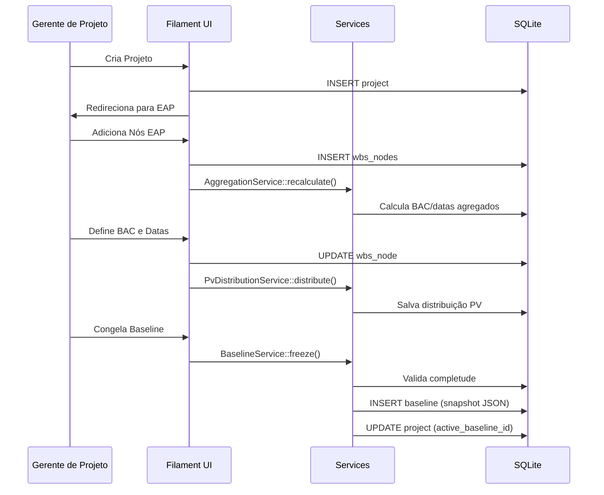
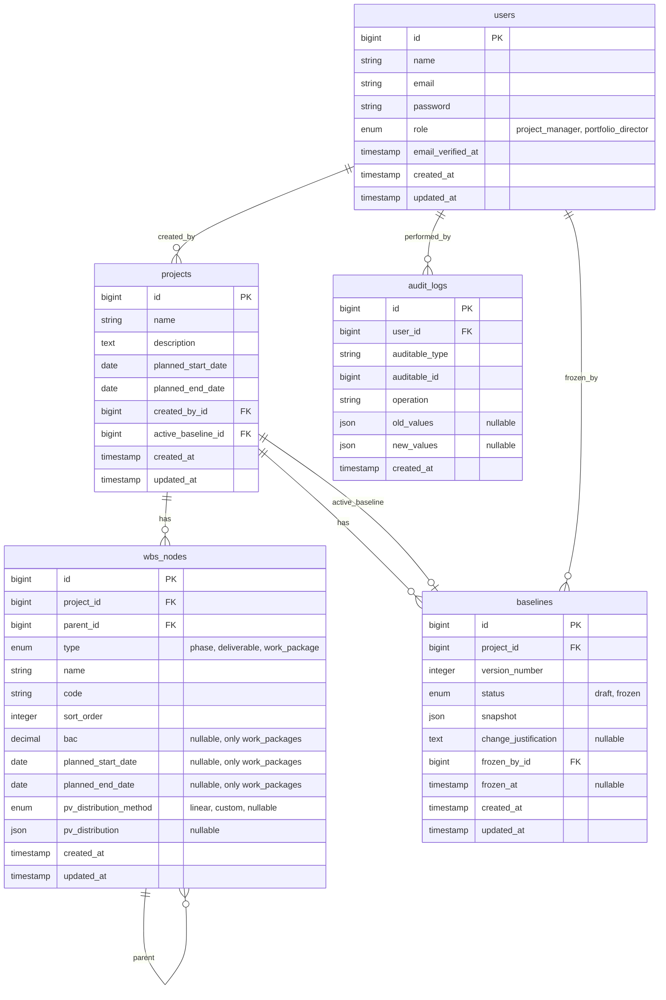

# Design — Módulo de Estruturação e Baseline

## Overview

Este documento descreve o design técnico do Módulo de Estruturação e Baseline da plataforma EVM. O módulo permite ao Gerente de Projeto criar a Estrutura Analítica do Projeto (EAP/WBS), atribuir orçamentos (BAC), distribuir o Planned Value (PV) ao longo do tempo, e gerenciar versões de Baseline com controle de mudanças e trilha de auditoria.

O módulo será construído inteiramente no painel Filament v5 (admin), utilizando Resources, Relation Managers, Actions e Custom Pages. O banco de dados é SQLite, os models seguem Eloquent com observers para auditoria, e a autorização é feita via Laravel Policies integradas ao Filament.

### Decisões de Design

1. **Adjacency List para EAP**: A hierarquia da EAP usa o padrão adjacency list (`parent_id`) com `type` enum para distinguir Fase/Entrega/Pacote de Trabalho. Isso simplifica queries de parentesco direto e é suficiente para a profundidade fixa de 3 níveis.
2. **Snapshot JSON para Baseline**: Cada versão de Baseline armazena um snapshot JSON completo da EAP, orçamentos e distribuição de PV. Isso garante imutabilidade sem necessidade de versionamento por registro.
3. **Distribuição PV como JSON**: A distribuição de PV por período é armazenada como JSON no Pacote de Trabalho, serializada/deserializada via cast customizado. Isso evita uma tabela auxiliar de períodos e simplifica o snapshot.
4. **Agregação calculada em tempo real**: BAC e datas agregadas são calculados bottom-up via Eloquent accessors e service class, não armazenados redundantemente. Isso evita inconsistências.
5. **Auditoria via Observer**: Um model observer genérico captura todas as mudanças em Project, WbsNode e Baseline, registrando na tabela `audit_logs`.
6. **RBAC via Spatie-less approach**: Papéis são armazenados diretamente na tabela `users` (coluna `role` enum) e verificados via Laravel Policies. Não há necessidade de pacote externo para apenas 2 papéis.

## Architecture

### Diagrama de Componentes

```mermaid
graph TB
    subgraph "Filament Admin Panel"
        PR[ProjectResource]
        WBS[WbsNodeResource<br/>Nested Resource]
        BL[BaselineResource<br/>Relation Manager]
        AL[AuditLogResource<br/>Read-only]
        PVPage[PvDistributionPage<br/>Custom Page]
    end

    subgraph "Domain Layer"
        AggSvc[AggregationService]
        PVSvc[PvDistributionService]
        BLSvc[BaselineService]
        AuditObs[AuditObserver]
    end

    subgraph "Eloquent Models"
        Project[Project]
        WbsNode[WbsNode]
        Baseline[Baseline]
        AuditLog[AuditLog]
        User[User]
    end

    subgraph "Policies"
        PP[ProjectPolicy]
        WP[WbsNodePolicy]
        BP[BaselinePolicy]
        ALP[AuditLogPolicy]
    end

    PR --> Project
    WBS --> WbsNode
    BL --> Baseline
    AL --> AuditLog

    AggSvc --> WbsNode
    AggSvc --> Project
    PVSvc --> WbsNode
    BLSvc --> Baseline
    BLSvc --> WbsNode
    BLSvc --> Project

    AuditObs --> AuditLog
    AuditObs -.-> Project
    AuditObs -.-> WbsNode
    AuditObs -.-> Baseline

    PP --> User
    WP --> User
    BP --> User
    ALP --> User
```



### Fluxo de Dados Principal



## Components and Interfaces

### Models

| Model      | Responsabilidade                                                                                  |
| ---------- | ------------------------------------------------------------------------------------------------- |
| `Project`  | Entidade raiz. Possui nome, descrição, datas planejadas. Relaciona-se com WbsNodes e Baselines.   |
| `WbsNode`  | Nó genérico da EAP. Tipo enum (phase/deliverable/work_package). Adjacency list via `parent_id`.   |
| `Baseline` | Versão congelada do plano. Contém snapshot JSON, status (draft/frozen), justificativa de mudança. |
| `AuditLog` | Registro imutável de auditoria. Sem soft deletes, sem updates.                                    |
| `User`     | Estendido com coluna `role` (project_manager/portfolio_director).                                 |

### Services

| Service                 | Responsabilidade                                                                                  |
| ----------------------- | ------------------------------------------------------------------------------------------------- |
| `AggregationService`    | Calcula BAC agregado e datas agregadas bottom-up na árvore EAP.                                   |
| `PvDistributionService` | Distribui BAC ao longo do tempo (linear ou personalizado). Serializa/deserializa distribuição PV. |
| `BaselineService`       | Valida completude dos pacotes de trabalho, cria snapshot, congela/descongela baselines.           |

### Filament Resources

| Resource                  | Tipo                 | Descrição                                                                                             |
| ------------------------- | -------------------- | ----------------------------------------------------------------------------------------------------- |
| `ProjectResource`         | Resource             | CRUD de projetos. Lista, cria, edita. Página de edição contém relation managers para EAP e Baselines. |
| `WbsNodeResource`         | Nested Resource      | CRUD de nós EAP dentro de um projeto. Exibe hierarquia, permite reordenação.                          |
| `BaselineRelationManager` | Relation Manager     | Lista baselines do projeto. Ações de congelar, criar nova versão.                                     |
| `AuditLogResource`        | Resource (read-only) | Listagem e filtros da trilha de auditoria. Sem create/edit/delete.                                    |

### Policies

| Policy           | Regras                                                                |
| ---------------- | --------------------------------------------------------------------- |
| `ProjectPolicy`  | PM: full CRUD. Director: viewAny, view.                               |
| `WbsNodePolicy`  | PM: full CRUD (bloqueado se baseline ativa). Director: viewAny, view. |
| `BaselinePolicy` | PM: create, freeze, change. Director: viewAny, view.                  |
| `AuditLogPolicy` | PM e Director: viewAny, view. Ninguém: create, update, delete.        |

### Observers

| Observer        | Eventos                                                 | Ação                                              |
| --------------- | ------------------------------------------------------- | ------------------------------------------------- |
| `AuditObserver` | created, updated, deleted em Project, WbsNode, Baseline | Cria registro em `audit_logs` com old/new values. |

## Data Models

### Diagrama ER



### Detalhamento das Tabelas

#### `projects`

| Coluna               | Tipo        | Constraints                     | Descrição                   |
| -------------------- | ----------- | ------------------------------- | --------------------------- |
| `id`                 | bigint      | PK, auto                        | Identificador único         |
| `name`               | string(255) | required                        | Nome do projeto             |
| `description`        | text        | nullable                        | Descrição do projeto        |
| `planned_start_date` | date        | required                        | Data de início planejada    |
| `planned_end_date`   | date        | required, >= planned_start_date | Data de fim planejada       |
| `created_by_id`      | bigint      | FK users.id                     | Gerente que criou o projeto |
| `active_baseline_id` | bigint      | FK baselines.id, nullable       | Baseline ativa atual        |
| `created_at`         | timestamp   | auto                            |                             |
| `updated_at`         | timestamp   | auto                            |                             |

#### `wbs_nodes`

| Coluna                   | Tipo          | Constraints                               | Descrição                                |
| ------------------------ | ------------- | ----------------------------------------- | ---------------------------------------- |
| `id`                     | bigint        | PK, auto                                  | Identificador único                      |
| `project_id`             | bigint        | FK projects.id, cascade delete            | Projeto pai                              |
| `parent_id`              | bigint        | FK wbs_nodes.id, nullable, cascade delete | Nó pai na hierarquia                     |
| `type`                   | enum          | phase/deliverable/work_package            | Tipo do nó                               |
| `name`                   | string(255)   | required                                  | Nome do nó                               |
| `code`                   | string(50)    | required                                  | Código hierárquico (ex: 1.0, 1.1, 1.1.1) |
| `sort_order`             | integer       | required, default 0                       | Ordem dentro do nível                    |
| `bac`                    | decimal(15,2) | nullable                                  | BAC (apenas work_packages)               |
| `planned_start_date`     | date          | nullable                                  | Data início (apenas work_packages)       |
| `planned_end_date`       | date          | nullable                                  | Data fim (apenas work_packages)          |
| `pv_distribution_method` | enum          | linear/custom, nullable                   | Método de distribuição PV                |
| `pv_distribution`        | json          | nullable                                  | Distribuição PV serializada              |
| `created_at`             | timestamp     | auto                                      |                                          |
| `updated_at`             | timestamp     | auto                                      |                                          |

**Formato do JSON `pv_distribution`:**

```json
[
    { "period": "2025-01", "value": 5000.0 },
    { "period": "2025-02", "value": 5000.0 },
    { "period": "2025-03", "value": 5000.0 }
]
```

#### `baselines`

| Coluna                 | Tipo      | Constraints                    | Descrição                                  |
| ---------------------- | --------- | ------------------------------ | ------------------------------------------ |
| `id`                   | bigint    | PK, auto                       | Identificador único                        |
| `project_id`           | bigint    | FK projects.id, cascade delete | Projeto                                    |
| `version_number`       | integer   | required                       | Número sequencial da versão                |
| `status`               | enum      | draft/frozen                   | Estado da baseline                         |
| `snapshot`             | json      | required                       | Snapshot completo da EAP                   |
| `change_justification` | text      | nullable                       | Justificativa (obrigatória a partir da v2) |
| `frozen_by_id`         | bigint    | FK users.id, nullable          | Quem congelou                              |
| `frozen_at`            | timestamp | nullable                       | Quando foi congelada                       |
| `created_at`           | timestamp | auto                           |                                            |
| `updated_at`           | timestamp | auto                           |                                            |

**Formato do JSON `snapshot`:**

```json
{
    "project": {
        "name": "Projeto X",
        "planned_start_date": "2025-01-01",
        "planned_end_date": "2025-12-31"
    },
    "wbs_nodes": [
        {
            "id": 1,
            "type": "phase",
            "name": "Fase 1",
            "code": "1.0",
            "parent_id": null,
            "bac": null,
            "planned_start_date": null,
            "planned_end_date": null,
            "pv_distribution": null,
            "children": [...]
        }
    ],
    "total_bac": 150000.00
}
```

#### `audit_logs`

| Coluna           | Tipo      | Constraints | Descrição                 |
| ---------------- | --------- | ----------- | ------------------------- |
| `id`             | bigint    | PK, auto    | Identificador único       |
| `user_id`        | bigint    | FK users.id | Quem realizou a ação      |
| `auditable_type` | string    | required    | Classe do model (morph)   |
| `auditable_id`   | bigint    | required    | ID do registro            |
| `operation`      | string    | required    | Tipo de operação          |
| `old_values`     | json      | nullable    | Valores anteriores        |
| `new_values`     | json      | nullable    | Valores novos             |
| `created_at`     | timestamp | auto        | Sem updated_at (imutável) |

**Operações registradas:** `project_created`, `project_updated`, `wbs_node_created`, `wbs_node_updated`, `wbs_node_deleted`, `bac_changed`, `dates_changed`, `pv_distribution_changed`, `baseline_frozen`, `baseline_activated`.

### Alteração na tabela `users`

Adicionar coluna `role` (enum: `project_manager`, `portfolio_director`) com default `project_manager`.

### Indexes

- `wbs_nodes`: index composto em `(project_id, parent_id)` para queries hierárquicas
- `wbs_nodes`: index em `(project_id, type)` para filtrar por tipo
- `audit_logs`: index em `(auditable_type, auditable_id)` para consultas por entidade
- `audit_logs`: index em `(user_id, created_at)` para filtros de auditoria
- `baselines`: index em `(project_id, status)` para buscar baseline ativa

## Correctness Properties

_A property is a characteristic or behavior that should hold true across all valid executions of a system — essentially, a formal statement about what the system should do. Properties serve as the bridge between human-readable specifications and machine-verifiable correctness guarantees._

### Property 1: BAC aggregation invariant

_For any_ valid WBS tree with BAC values assigned to work packages, the BAC of the project SHALL equal the sum of the BACs of all leaf work packages, and the BAC of any non-leaf node SHALL equal the sum of the BACs of its direct children.

**Validates: Requirements 3.1, 3.3, 3.4, 3.5, 3.6, 10.1, 10.3, 10.5**

### Property 2: Date aggregation invariant

_For any_ valid WBS tree with dates assigned to work packages, the start date of any non-leaf node SHALL equal the minimum start date among its descendant work packages, and the end date SHALL equal the maximum end date among its descendant work packages.

**Validates: Requirements 4.3, 4.4, 4.5, 4.6, 4.7**

### Property 3: Date validation rules

_For any_ pair of start and end dates (on projects or work packages), the system SHALL accept the pair if and only if end_date >= start_date. Additionally, _for any_ work package date range within a project, the work package dates SHALL be within the project's planned date range.

**Validates: Requirements 1.3, 4.1, 4.2**

### Property 4: WBS hierarchy enforcement

_For any_ combination of parent node type and child node type, the system SHALL accept the child only if the combination follows the hierarchy: root→phase, phase→deliverable, deliverable→work_package. All other combinations SHALL be rejected.

**Validates: Requirements 2.2, 2.7**

### Property 5: Hierarchical code consistency

_For any_ valid WBS tree, after any insertion or reorder operation, every node's hierarchical code SHALL reflect its actual position in the tree (depth level and sibling order), and no two siblings SHALL share the same code.

**Validates: Requirements 2.3, 2.4**

### Property 6: Cascade deletion of descendants

_For any_ WBS node with descendants, deleting that node SHALL also delete all of its descendants. The count of remaining nodes after deletion SHALL equal the original count minus the deleted node and all its descendants.

**Validates: Requirements 2.5**

### Property 7: PV distribution sum equals BAC

_For any_ work package with a BAC and a PV distribution (linear or custom), the sum of all period values in the distribution SHALL equal the BAC of the work package (within floating-point tolerance of 0.01).

**Validates: Requirements 5.1, 5.3**

### Property 8: PV cumulative aggregation

_For any_ valid WBS tree with PV distributions on work packages, the cumulative PV at any period for a non-leaf node SHALL equal the sum of the cumulative PVs of its descendant work packages at that same period.

**Validates: Requirements 5.4, 5.5, 10.2**

### Property 9: PV distribution serialization round-trip

_For any_ valid PV distribution (array of period/value pairs), serializing and then deserializing SHALL produce a distribution equivalent to the original.

**Validates: Requirements 5.7, 5.8, 5.9**

### Property 10: Baseline freeze completeness validation

_For any_ project with work packages, the baseline freeze SHALL succeed if and only if every work package has a BAC > 0, valid start/end dates, and a non-empty PV distribution. If any work package is incomplete, the freeze SHALL be rejected and the incomplete work packages SHALL be identified.

**Validates: Requirements 6.1, 6.2**

### Property 11: Frozen baseline blocks modifications

_For any_ project with a frozen active baseline, all attempts to modify WBS nodes (create, update, delete), BAC values, dates, or PV distributions SHALL be rejected.

**Validates: Requirements 6.4**

### Property 12: Single active baseline invariant

_For any_ project, at any point in time, there SHALL be at most one baseline with active status. When a new baseline is frozen, it SHALL become the active one and the previously active baseline SHALL be deactivated.

**Validates: Requirements 6.6, 7.5**

### Property 13: Mutations produce audit logs

_For any_ create, update, or delete operation on Project, WbsNode, or Baseline models, the system SHALL create an audit log entry containing the user ID, timestamp, operation type, and the old/new values.

**Validates: Requirements 8.1**

### Property 14: Audit logs are immutable

_For any_ audit log record, attempts to update or delete it SHALL fail. The audit_logs table SHALL only support INSERT operations.

**Validates: Requirements 8.3**

### Property 15: Role-based access control enforcement

_For any_ operation and user role combination, a user with role `project_manager` SHALL be allowed to perform all CRUD operations, while a user with role `portfolio_director` SHALL only be allowed to perform read operations (viewAny, view). Write operations by a director SHALL be rejected.

**Validates: Requirements 9.2, 9.3, 9.4**

### Property 16: Aggregation confluence

_For any_ set of work packages with BAC values, the aggregated BAC at the project level SHALL be the same regardless of the order in which the work packages are processed.

**Validates: Requirements 10.4**

## Error Handling

### Validation Errors

| Cenário                                      | Comportamento                                                          |
| -------------------------------------------- | ---------------------------------------------------------------------- |
| Nome do projeto vazio ou > 255 chars         | Retorna erro de validação no formulário Filament                       |
| Data fim < data início (projeto ou WP)       | Retorna erro de validação com mensagem específica                      |
| BAC negativo ou zero                         | Retorna erro de validação                                              |
| BAC com mais de 2 casas decimais             | Arredonda ou rejeita conforme validação                                |
| Datas do WP fora do intervalo do projeto     | Retorna erro de validação com mensagem indicando o intervalo válido    |
| Hierarquia inválida (ex: WP direto sob Fase) | Retorna erro de validação com mensagem explicando a hierarquia correta |
| Soma PV ≠ BAC na distribuição personalizada  | Retorna erro de validação indicando a diferença                        |

### Business Rule Errors

| Cenário                                            | Comportamento                                                              |
| -------------------------------------------------- | -------------------------------------------------------------------------- |
| Tentativa de editar projeto com baseline ativa     | Bloqueia a ação e exibe notificação informando necessidade de nova versão  |
| Tentativa de congelar baseline com WPs incompletos | Rejeita e lista os WPs incompletos em notificação                          |
| Tentativa de modificar EAP com baseline congelada  | Bloqueia e exibe notificação                                               |
| Tentativa de deletar/editar audit log              | Operação não disponível na interface; se tentada via código, lança exceção |

### System Errors

| Cenário                         | Comportamento                                                          |
| ------------------------------- | ---------------------------------------------------------------------- |
| Falha ao criar snapshot JSON    | Lança exceção, transação é revertida, baseline não é criada            |
| Erro de integridade referencial | Transação revertida, mensagem genérica ao usuário                      |
| Concurrent modification         | Handled pelo Eloquent timestamps (optimistic locking via `updated_at`) |

Todas as operações de escrita que envolvem múltiplas tabelas (congelamento de baseline, deleção em cascata) devem ser envolvidas em `DB::transaction()`.

## Testing Strategy

### Abordagem Dual: Unit Tests + Property Tests

Este módulo combina testes unitários (exemplos específicos e edge cases) com testes baseados em propriedades (verificação universal) para cobertura abrangente.

### Property-Based Tests (Pest + Datasets)

Como o ecossistema PHP não possui uma biblioteca PBT madura equivalente a QuickCheck/Hypothesis, utilizaremos **Pest datasets com geradores randomizados** para simular property-based testing. Cada property test usará `repeat(100)` ou datasets com 100+ entradas geradas por Faker/generators customizados.

**Biblioteca:** Pest v4 com `repeat()` e datasets gerados por Faker
**Mínimo de iterações:** 100 por property test
**Tag format:** Comentário `// Feature: project-structuring-baseline, Property {N}: {title}`

#### Properties a implementar como testes:

| Property                      | Arquivo de Teste                           | Estratégia                                                      |
| ----------------------------- | ------------------------------------------ | --------------------------------------------------------------- |
| P1: BAC aggregation           | `tests/Unit/AggregationServiceTest.php`    | Gerar árvores EAP aleatórias com BACs, verificar soma bottom-up |
| P2: Date aggregation          | `tests/Unit/AggregationServiceTest.php`    | Gerar árvores com datas, verificar min/max bottom-up            |
| P3: Date validation           | `tests/Unit/ValidationTest.php`            | Gerar pares de datas aleatórios, verificar regras               |
| P4: Hierarchy enforcement     | `tests/Unit/WbsNodeTest.php`               | Gerar combinações de tipos pai/filho, verificar validação       |
| P5: Code consistency          | `tests/Unit/WbsNodeTest.php`               | Gerar árvores, inserir/reordenar, verificar códigos             |
| P6: Cascade deletion          | `tests/Feature/WbsNodeTest.php`            | Gerar árvores, deletar nós, verificar contagem                  |
| P7: PV sum = BAC              | `tests/Unit/PvDistributionServiceTest.php` | Gerar BACs e ranges de datas, verificar soma                    |
| P8: PV cumulative aggregation | `tests/Unit/PvDistributionServiceTest.php` | Gerar árvores com PV, verificar agregação                       |
| P9: PV round-trip             | `tests/Unit/PvDistributionServiceTest.php` | Gerar distribuições, serializar/deserializar                    |
| P10: Freeze validation        | `tests/Feature/BaselineServiceTest.php`    | Gerar projetos com WPs variados, verificar freeze               |
| P11: Frozen blocks mods       | `tests/Feature/BaselineServiceTest.php`    | Gerar modificações em projetos com baseline                     |
| P12: Single active baseline   | `tests/Feature/BaselineServiceTest.php`    | Gerar sequências de freeze, verificar unicidade                 |
| P13: Mutations → audit        | `tests/Feature/AuditLogTest.php`           | Realizar operações, verificar logs                              |
| P14: Audit immutability       | `tests/Feature/AuditLogTest.php`           | Tentar update/delete, verificar falha                           |
| P15: RBAC enforcement         | `tests/Feature/RbacTest.php`               | Gerar operações com diferentes roles                            |
| P16: Confluence               | `tests/Unit/AggregationServiceTest.php`    | Processar WPs em ordens diferentes, comparar resultado          |

### Unit Tests (Exemplos e Edge Cases)

| Área            | Arquivo                                  | Cenários                                                         |
| --------------- | ---------------------------------------- | ---------------------------------------------------------------- |
| Projeto CRUD    | `tests/Feature/ProjectResourceTest.php`  | Criar projeto, editar sem baseline, bloquear edição com baseline |
| EAP CRUD        | `tests/Feature/WbsNodeResourceTest.php`  | Adicionar nós, exibir árvore, reordenar                          |
| Baseline        | `tests/Feature/BaselineResourceTest.php` | Congelar, criar nova versão, copiar dados                        |
| Auditoria       | `tests/Feature/AuditLogResourceTest.php` | Filtros por projeto, operação, usuário, datas                    |
| Distribuição PV | `tests/Feature/PvDistributionTest.php`   | Distribuição linear, personalizada, redistribuição               |

### Filament-Specific Tests

Utilizar `pestphp/pest-plugin-livewire` para testar:

- Renderização de Resources (list, create, edit pages)
- Ações (freeze baseline, create new version)
- Relation Managers (baselines, wbs nodes)
- Policies integration (PM vs Director access)

### Cobertura Esperada

- **Services (AggregationService, PvDistributionService, BaselineService):** 100% via property tests + unit tests
- **Models (validação, casts, relationships):** 90%+ via feature tests
- **Policies:** 100% via RBAC property tests
- **Filament Resources:** Smoke tests para renderização + testes de ações críticas
