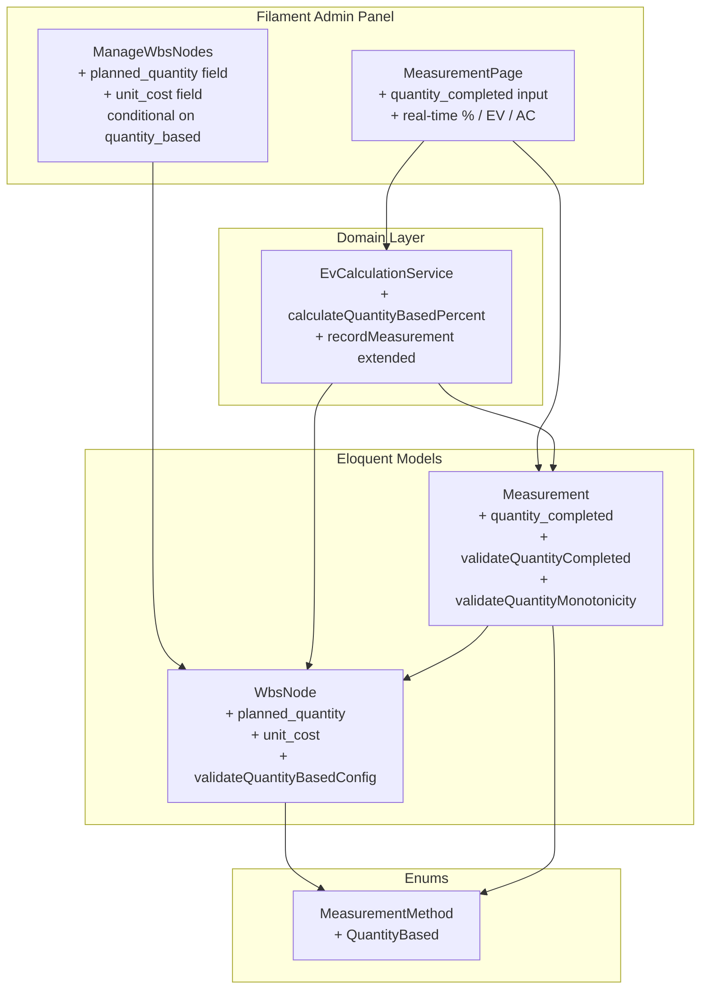
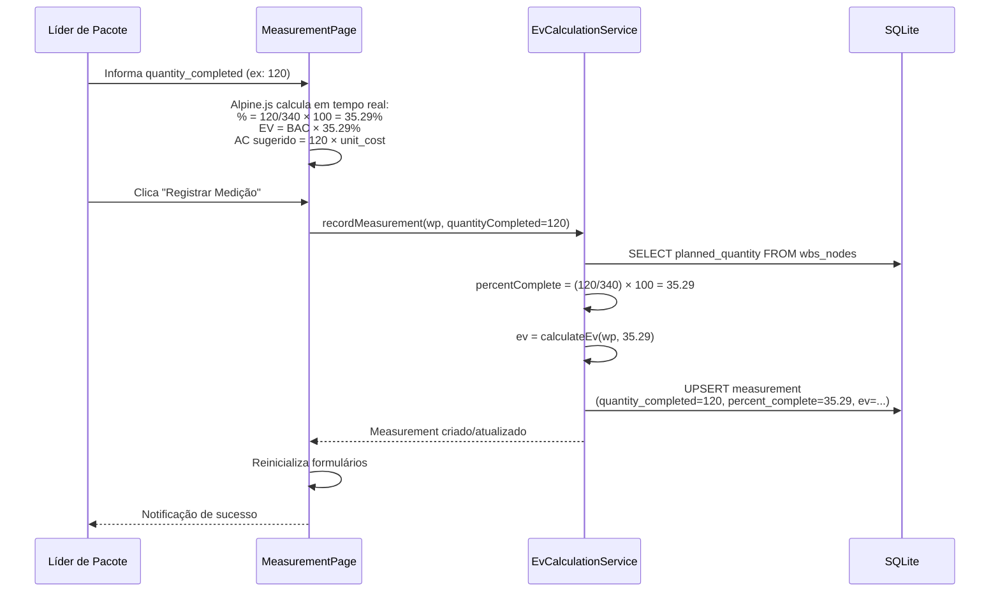
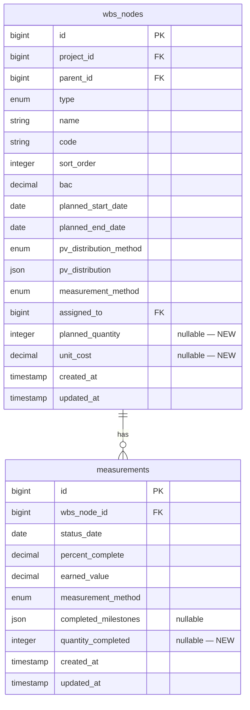

# Design — Método de Medição por Unidades Concluídas (Quantity-Based)

## Overview

Este documento descreve o design técnico para a adição do quinto método de medição — **Unidades Concluídas** (`quantity_based`) — ao módulo de Apontamento e Medição da plataforma EVM. O método permite que o responsável pelo pacote de trabalho informe a **quantidade de unidades concluídas** em vez de um percentual, e o sistema calcula automaticamente o percentual de conclusão e o Earned Value (EV).

O módulo **estende** a arquitetura existente do spec `measurement-tracking`, reutilizando os models `Project`, `WbsNode`, `Baseline`, `Measurement`, `ActualCost`, o `EvCalculationService`, o `MeasurementPage` (Filament custom page), o `ManageWbsNodes` (formulário de WBS), o enum `MeasurementMethod`, e todas as policies e observers existentes. Não recria nenhuma dessas entidades.

### Decisões de Design

1. **Novo caso no enum `MeasurementMethod`**: Adicionar `QuantityBased = 'quantity_based'` com label "Unidades Concluídas", cor `primary` e ícone `Heroicon::OutlinedCubeTransparent`. Segue o padrão dos demais valores com `HasLabel`, `HasColor` e `HasIcon`.

2. **Campos `planned_quantity` e `unit_cost` no `WbsNode`**: Armazenados diretamente na tabela `wbs_nodes` como colunas nullable. São relevantes apenas quando `measurement_method = quantity_based`. A `planned_quantity` é um inteiro positivo obrigatório para o método; o `unit_cost` é um decimal(15,2) opcional usado para sugerir o AC.

3. **Campo `quantity_completed` no `Measurement`**: Armazenado como coluna `integer nullable` na tabela `measurements`. Preenchido apenas para medições com método `quantity_based`. O `percent_complete` e `earned_value` são calculados automaticamente a partir de `quantity_completed / planned_quantity`.

4. **Cálculo automático de % Complete e EV**: Quando o método é `quantity_based`, o `EvCalculationService` recebe a `quantity_completed` e a `planned_quantity`, calcula `percent_complete = (quantity_completed / planned_quantity) × 100` arredondado para 2 casas decimais, e então calcula `EV = BAC × (percent_complete / 100)` usando a fórmula existente.

5. **Monotonicidade por quantidade**: A validação de não-regressão é aplicada sobre a `quantity_completed` (não sobre o `percent_complete`), garantindo que a quantidade nunca diminua entre períodos. Isso é mais natural para o método e evita inconsistências de arredondamento.

6. **AC sugerido**: Quando o `unit_cost` está definido, o sistema calcula `AC sugerido = quantity_completed × unit_cost` e pré-preenche o campo de custo real. O PM pode aceitar ou alterar livremente antes de salvar. O AC sugerido é apenas uma conveniência de UI — não é persistido separadamente.

7. **Compatibilidade total com regras existentes**: O novo método respeita todas as regras do módulo de medição: imutabilidade de registros históricos, carry-forward, agregação bottom-up de EV, controle de acesso (RBAC), auditoria, e sincronização na mesma Data de Status.

8. **Campos condicionais no formulário WBS**: Os campos `planned_quantity` e `unit_cost` aparecem no formulário de WBS Node apenas quando `measurement_method = quantity_based`. Usam `->visible()` com `Get` reativo do Filament v5.

9. **UI adaptativa na MeasurementPage**: O Blade template da MeasurementPage ganha um novo bloco `@elseif` para o método `quantity_based`, exibindo campo numérico de quantidade, referência à quantidade planejada, e cálculos em tempo real de % Complete, EV e AC sugerido via Alpine.js.

## Architecture

### Diagrama de Componentes (Extensão)



### Fluxo de Dados — Registro de Medição por Unidades Concluídas



## Components and Interfaces

### Enum — Extensão

| Enum                | Alteração                                                                                                            |
| ------------------- | -------------------------------------------------------------------------------------------------------------------- |
| `MeasurementMethod` | Novo caso `QuantityBased = 'quantity_based'` com label "Unidades Concluídas", cor `primary`, ícone `CubeTransparent` |

### Models — Extensões

| Model         | Alteração                                                                                                                                                                                                                                                                                                                                      |
| ------------- | ---------------------------------------------------------------------------------------------------------------------------------------------------------------------------------------------------------------------------------------------------------------------------------------------------------------------------------------------- |
| `WbsNode`     | Novas colunas `planned_quantity` (integer, nullable) e `unit_cost` (decimal(15,2), nullable). Nova validação `validateQuantityBasedConfig()` no `booted()`: se `measurement_method = quantity_based`, `planned_quantity` é obrigatório e deve ser inteiro > 0. `unit_cost`, se informado, deve ser > 0. Adicionados ao `$fillable` e `$casts`. |
| `Measurement` | Nova coluna `quantity_completed` (integer, nullable). Adicionada ao `$fillable` e `$casts`. Novas validações no `booted()`: `validateQuantityCompleted()` (inteiro >= 0, <= planned_quantity) e `validateQuantityMonotonicity()` (quantity_completed >= anterior).                                                                             |

### Service — Extensão

| Service                | Alteração                                                                                                                                                                                                                                                                                                                                                                   |
| ---------------------- | --------------------------------------------------------------------------------------------------------------------------------------------------------------------------------------------------------------------------------------------------------------------------------------------------------------------------------------------------------------------------- |
| `EvCalculationService` | Novo método `calculateQuantityBasedPercent(WbsNode $wp, int $quantityCompleted): float` que retorna `round(($quantityCompleted / $wp->planned_quantity) * 100, 2)`. O método `recordMeasurement()` é estendido para aceitar `?int $quantityCompleted` e, quando o método é `quantity_based`, calcular o `percentComplete` automaticamente e persistir `quantity_completed`. |

### Filament — Extensões

| Componente        | Alteração                                                                                                                                                                                                                                                                      |
| ----------------- | ------------------------------------------------------------------------------------------------------------------------------------------------------------------------------------------------------------------------------------------------------------------------------ |
| `ManageWbsNodes`  | Dois novos campos no formulário: `planned_quantity` (TextInput, inteiro, required quando quantity_based) e `unit_cost` (TextInput com máscara BRL, opcional). Ambos visíveis apenas quando `measurement_method = quantity_based`, usando `->visible()` com `Get` reativo.      |
| `MeasurementPage` | Novo bloco no método `recordMeasurement()` para tratar `quantity_based`: lê `quantity_completed` do form, calcula % via service, passa para `recordMeasurement()`. Novo campo `quantity_completed` no `$wpForms`. Inicialização carrega `quantity_completed` do carry-forward. |
| Blade template    | Novo `@elseif` para `quantity_based`: campo numérico de quantidade, label "X / {planned_quantity} unidades", cálculos em tempo real via Alpine.js (`x-data`, `x-on:input`), exibição de AC sugerido quando `unit_cost` está definido.                                          |

### Factories — Extensões

| Factory              | Alteração                                                                                                                                                                                          |
| -------------------- | -------------------------------------------------------------------------------------------------------------------------------------------------------------------------------------------------- |
| `WbsNodeFactory`     | Novo método `quantityBased(int $plannedQuantity, ?float $unitCost)` que configura `measurement_method = quantity_based`, `planned_quantity` e opcionalmente `unit_cost`.                           |
| `MeasurementFactory` | Novo método `quantityBased(int $quantityCompleted, int $plannedQuantity)` que configura `measurement_method = quantity_based`, `quantity_completed`, e calcula `percent_complete` automaticamente. |

## Data Models

### Diagrama ER (Extensão)



### Detalhamento das Alterações

#### Alteração em `wbs_nodes` — adicionar `planned_quantity` e `unit_cost`

| Coluna             | Tipo          | Constraints                         | Descrição                                            |
| ------------------ | ------------- | ----------------------------------- | ---------------------------------------------------- |
| `planned_quantity` | integer       | nullable, > 0 quando quantity_based | Quantidade total planejada de unidades para o pacote |
| `unit_cost`        | decimal(15,2) | nullable, > 0 quando informado      | Custo unitário por unidade de trabalho (contrato)    |

**Validações no model (`booted()`):**

- Se `measurement_method = quantity_based`:
    - `planned_quantity` é obrigatório (não pode ser null)
    - `planned_quantity` deve ser inteiro > 0
- Se `measurement_method != quantity_based`:
    - `planned_quantity` e `unit_cost` são ignorados (podem ser null)
- `unit_cost`, quando informado, deve ser numérico > 0

#### Alteração em `measurements` — adicionar `quantity_completed`

| Coluna               | Tipo    | Constraints                                               | Descrição                                              |
| -------------------- | ------- | --------------------------------------------------------- | ------------------------------------------------------ |
| `quantity_completed` | integer | nullable, >= 0, <= planned_quantity quando quantity_based | Quantidade de unidades concluídas até a Data de Status |

**Validações no model (`booted()`):**

- Se `measurement_method = quantity_based`:
    - `quantity_completed` é obrigatório (não pode ser null)
    - `quantity_completed` deve ser inteiro >= 0
    - `quantity_completed` deve ser <= `wbs_node.planned_quantity`
    - `quantity_completed` deve ser >= `quantity_completed` do registro anterior (monotonicidade)
- Se `measurement_method != quantity_based`:
    - `quantity_completed` é ignorado (deve ser null)

### Indexes

Nenhum novo index necessário. Os indexes existentes em `measurements (wbs_node_id, status_date)` já cobrem as queries de carry-forward e upsert para o novo método.

### Migration

Uma única migration adicionará as três colunas:

```php
// add_quantity_fields_to_wbs_nodes_and_measurements_tables
Schema::table('wbs_nodes', function (Blueprint $table) {
    $table->unsignedInteger('planned_quantity')->nullable()->after('assigned_to');
    $table->decimal('unit_cost', 15, 2)->nullable()->after('planned_quantity');
});

Schema::table('measurements', function (Blueprint $table) {
    $table->unsignedInteger('quantity_completed')->nullable()->after('completed_milestones');
});
```

## Correctness Properties

_A property is a characteristic or behavior that should hold true across all valid executions of a system — essentially, a formal statement about what the system should do. Properties serve as the bridge between human-readable specifications and machine-verifiable correctness guarantees._

### Property 1: Quantity-based configuration validation

_For any_ work package with `measurement_method = quantity_based`, the system SHALL accept the configuration if and only if `planned_quantity` is a positive integer (> 0). Configurations where `planned_quantity` is null, zero, or negative SHALL be rejected with a validation error.

**Validates: Requirements 2.1, 2.2, 2.9**

### Property 2: Unit cost validation

_For any_ work package with `measurement_method = quantity_based` and a non-null `unit_cost`, the system SHALL accept the value if and only if it is a positive numeric value (> 0) with at most two decimal places. Zero, negative, or values with more than two decimal places SHALL be rejected.

**Validates: Requirements 2.5**

### Property 3: Quantity fields ignored for non-quantity-based methods

_For any_ work package with a `measurement_method` other than `quantity_based`, the system SHALL accept the configuration regardless of the values of `planned_quantity` and `unit_cost`. These fields SHALL have no effect on validation or behavior for other methods.

**Validates: Requirements 2.8**

### Property 4: Quantity-based measurement calculation

_For any_ valid combination of `quantity_completed` (integer, 0 ≤ qty ≤ planned_quantity), `planned_quantity` (integer > 0), and `BAC` (from active baseline), recording a measurement SHALL produce a record where `percent_complete = round((quantity_completed / planned_quantity) × 100, 2)` and `earned_value = round(BAC × (quantity_completed / planned_quantity), 2)`. The record SHALL also contain `measurement_method = quantity_based` and the correct `quantity_completed` value.

**Validates: Requirements 3.4, 3.5, 3.7**

### Property 5: Quantity completed bounds validation

_For any_ work package with `measurement_method = quantity_based` and `planned_quantity = N`, the system SHALL accept a `quantity_completed` value if and only if it is a non-negative integer (>= 0) and does not exceed `N`. Values that are negative, non-integer, or greater than `N` SHALL be rejected.

**Validates: Requirements 3.2, 3.3**

### Property 6: Quantity completed monotonicity (non-regression)

_For any_ work package with `measurement_method = quantity_based` and an existing measurement with `quantity_completed = Q_prev` at a previous status date, a new measurement SHALL be accepted only if its `quantity_completed >= Q_prev`. Attempts to register a `quantity_completed` lower than the previous value SHALL be rejected with a message indicating the minimum allowed quantity.

**Validates: Requirements 4.1, 4.2**

### Property 7: Quantity-based measurement upsert

_For any_ work package with `measurement_method = quantity_based` and a given status date, recording a measurement when one already exists for that (wbs_node_id, status_date) pair SHALL update the existing record rather than creating a duplicate. After the operation, there SHALL be exactly one measurement record per (wbs_node_id, status_date) pair, with the updated `quantity_completed`, `percent_complete`, and `earned_value`.

**Validates: Requirements 3.8**

### Property 8: Quantity fields round-trip persistence

_For any_ valid `planned_quantity` (integer > 0), `unit_cost` (positive decimal with ≤ 2 decimal places or null), and `quantity_completed` (integer, 0 ≤ qty ≤ planned_quantity), writing these values to the database and reading them back SHALL produce values equivalent to the originals. Specifically: `planned_quantity` and `quantity_completed` SHALL be exact integers, and `unit_cost` SHALL preserve its decimal precision.

**Validates: Requirements 2.3, 2.6, 3.6, 9.1, 9.2, 9.3**

### Property 9: Historical immutability for quantity-based measurements

_For any_ measurement with `measurement_method = quantity_based` whose `status_date` is strictly earlier than the project's current `status_date`, all update attempts SHALL be rejected. Only measurements where `status_date` equals the project's current `status_date` SHALL be editable.

**Validates: Requirements 7.1**

## Error Handling

### Validation Errors

| Cenário                                                                     | Comportamento                                                                                                       |
| --------------------------------------------------------------------------- | ------------------------------------------------------------------------------------------------------------------- |
| `planned_quantity` ausente quando `measurement_method = quantity_based`     | `InvalidArgumentException`: "A quantidade planejada é obrigatória para o método Unidades Concluídas."               |
| `planned_quantity` <= 0                                                     | `InvalidArgumentException`: "A quantidade planejada deve ser um valor inteiro positivo (maior que zero)."           |
| `planned_quantity` não inteiro (ex: 10.5)                                   | `InvalidArgumentException`: "A quantidade planejada deve ser um valor inteiro."                                     |
| `unit_cost` <= 0 quando informado                                           | `InvalidArgumentException`: "O custo unitário deve ser um valor positivo."                                          |
| `unit_cost` com mais de 2 casas decimais                                    | `InvalidArgumentException`: "O custo unitário deve ter no máximo 2 casas decimais."                                 |
| `quantity_completed` < 0                                                    | `InvalidArgumentException`: "A quantidade concluída deve ser maior ou igual a zero."                                |
| `quantity_completed` > `planned_quantity`                                   | `InvalidArgumentException`: "A quantidade concluída (X) não pode exceder a quantidade planejada (Y)."               |
| `quantity_completed` não inteiro                                            | `InvalidArgumentException`: "A quantidade concluída deve ser um valor inteiro."                                     |
| `quantity_completed` < `quantity_completed` do período anterior (regressão) | `InvalidArgumentException`: "A quantidade concluída não pode ser inferior à registrada anteriormente (X unidades)." |
| Alteração de método para `quantity_based` sem `planned_quantity`            | `InvalidArgumentException`: "A quantidade planejada é obrigatória para o método Unidades Concluídas."               |

### Business Rule Errors

| Cenário                                                               | Comportamento                                                                                                           |
| --------------------------------------------------------------------- | ----------------------------------------------------------------------------------------------------------------------- |
| Tentativa de registrar medição quantity_based sem Data de Status      | Bloqueia e exibe notificação: "Defina a Data de Status do projeto antes de registrar medições."                         |
| Tentativa de editar medição quantity_based de Data de Status anterior | Bloqueia e exibe notificação: "Registros de períodos anteriores são somente leitura."                                   |
| Alteração de método de/para quantity_based com registros existentes   | Exibe confirmação: "Este pacote já possui medições registradas. Novas medições usarão o novo método. Deseja continuar?" |

### Padrão de Tratamento de Erros

Segue o padrão existente do módulo `measurement-tracking`:

- Validações de domínio no model (`booted()`/`creating`/`updating`) lançam `InvalidArgumentException`
- O `MeasurementPage` e `ManageWbsNodes` capturam `InvalidArgumentException` com try/catch e exibem `Notification::make()->danger()` com a mensagem do erro
- Validações de formulário (min, max, integer) são adicionadas nos campos Filament para prevenir erros antes de chegar ao model
- Operações de escrita (registro de medição com cálculo de EV) são envolvidas em `DB::transaction()`

## Testing Strategy

### Abordagem Dual: Unit Tests + Property Tests

Este módulo contém lógica de cálculo (% Complete, EV a partir de quantidades), validação de domínio (ranges, inteiros, monotonicidade, configuração condicional), e serialização (round-trip de quantity_completed) — todos altamente adequados para property-based testing.

### Property-Based Tests (Pest + repeat/datasets)

Seguindo o padrão estabelecido no spec `measurement-tracking`, utilizaremos **Pest v4 com `repeat()` e datasets gerados por Faker/generators customizados** para simular property-based testing. Cada property test usará `repeat(100)` ou datasets com 100+ entradas.

**Biblioteca:** Pest v4 com `repeat()` e datasets gerados por Faker
**Mínimo de iterações:** 100 por property test
**Tag format:** Comentário `// Feature: quantity-based-measurement, Property {N}: {title}`

#### Properties a implementar como testes:

| Property                             | Arquivo de Teste                                        | Estratégia                                                                                                                  |
| ------------------------------------ | ------------------------------------------------------- | --------------------------------------------------------------------------------------------------------------------------- |
| P1: Quantity-based config validation | `tests/Unit/QuantityBasedConfigValidationTest.php`      | Gerar WPs com quantity_based e planned_quantity aleatórios (positivos, zero, negativos, null), verificar aceitação/rejeição |
| P2: Unit cost validation             | `tests/Unit/QuantityBasedConfigValidationTest.php`      | Gerar unit_cost aleatórios (positivos, zero, negativos, muitas casas decimais), verificar regras                            |
| P3: Quantity fields ignored          | `tests/Unit/QuantityBasedConfigValidationTest.php`      | Gerar WPs com métodos não-quantity_based e planned_quantity/unit_cost aleatórios, verificar que são aceitos                 |
| P4: Measurement calculation          | `tests/Unit/QuantityBasedCalculationTest.php`           | Gerar (quantity_completed, planned_quantity, BAC) aleatórios, verificar % e EV calculados                                   |
| P5: Quantity completed bounds        | `tests/Unit/QuantityBasedMeasurementValidationTest.php` | Gerar (quantity_completed, planned_quantity) aleatórios, verificar bounds                                                   |
| P6: Quantity monotonicity            | `tests/Unit/QuantityBasedMeasurementValidationTest.php` | Gerar sequências de quantity_completed, verificar que regressão é rejeitada                                                 |
| P7: Upsert behavior                  | `tests/Feature/QuantityBasedUpsertTest.php`             | Criar medições duplicadas para mesmo WP+date, verificar unicidade e atualização                                             |
| P8: Round-trip persistence           | `tests/Unit/QuantityBasedRoundTripTest.php`             | Gerar valores aleatórios de planned_quantity, unit_cost, quantity_completed, persistir e ler, verificar equivalência        |
| P9: Historical immutability          | `tests/Feature/QuantityBasedImmutabilityTest.php`       | Criar medições quantity_based em datas anteriores, avançar status_date, tentar editar, verificar bloqueio                   |

### Unit Tests (Exemplos e Edge Cases)

| Área             | Arquivo                                              | Cenários                                                                                                                                |
| ---------------- | ---------------------------------------------------- | --------------------------------------------------------------------------------------------------------------------------------------- |
| Enum             | `tests/Unit/MeasurementMethodEnumTest.php`           | Verificar label, cor e ícone do caso `QuantityBased`                                                                                    |
| WBS Form         | `tests/Feature/QuantityBasedWbsFormTest.php`         | Campos planned_quantity e unit_cost visíveis apenas para quantity_based; máscara BRL no unit_cost; required condicional                 |
| Measurement Page | `tests/Feature/QuantityBasedMeasurementPageTest.php` | Campo de quantidade exibido para quantity_based; cálculos em tempo real; AC sugerido pré-preenchido; histórico com coluna de quantidade |
| AC Sugerido      | `tests/Feature/QuantityBasedAcSuggestionTest.php`    | AC sugerido = qty × unit_cost quando unit_cost definido; campo vazio quando unit_cost ausente                                           |
| Método Change    | `tests/Feature/QuantityBasedMethodChangeTest.php`    | Confirmação ao alterar de/para quantity_based com registros existentes; auditoria da alteração                                          |
| Compatibilidade  | `tests/Feature/QuantityBasedCompatibilityTest.php`   | Carry-forward, agregação bottom-up, RBAC, auditoria — todos funcionando para quantity_based                                             |

### Filament-Specific Tests

Utilizar `pestphp/pest-plugin-livewire` para testar:

- Campos condicionais no `ManageWbsNodes` (planned_quantity, unit_cost visíveis apenas para quantity_based)
- Bloco de formulário adaptativo na `MeasurementPage` para quantity_based
- Cálculos em tempo real via Alpine.js (verificar que os atributos `x-data` e `x-on:input` estão presentes)
- AC sugerido pré-preenchido quando unit_cost está definido
- Histórico de medições com coluna de quantity_completed

### Cobertura Esperada

- **EvCalculationService (cálculo % e EV por quantidade):** 100% via property tests P4 + unit tests
- **WbsNode (validação de configuração quantity_based):** 100% via property tests P1, P2, P3 + unit tests
- **Measurement (validação de quantity_completed, bounds, monotonicidade):** 100% via property tests P5, P6 + unit tests
- **Round-trip persistence:** 100% via property test P8
- **Upsert e imutabilidade:** 100% via property tests P7, P9
- **Filament UI (formulários adaptativos, cálculos em tempo real):** Smoke tests + testes de interação
